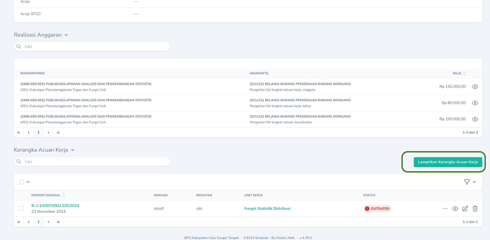

## Kewenangan Pengguna
Arsip yang telah bertanda tangan perlu di scan dan diupload untuk pengarsipan.
Berikut adalah user yang dapat melakukan upload arsip dokumen berdasarkan kewenangan.

| Arsip                 | Pengunggah                            |
| --------              | ------------------------------------- |
| Kerangka Acuan        | Arsiparis                             |
| SPM dan SP2D          | Arsiparis, PPSPM                      |
| Kontrak Mitra         | Arsiparis                             |
| BAST Kontrak Mitra    | Arsiparis                             |
| Naskah Masuk          | Pegawai, Ketua Tim, Kepala, Arsiparis |
| Naskah Keluar         | Pegawai, Ketua Tim, Kepala, Arsiparis |
| Kertas Kerja Reward   | Kasubbag Umum, Arsiparis              |
| SK Reward             | Kasubbag Umum, Arsiparis              |
| Sertifikat Reward     | Kasubbag Umum, Arsiparis              |
| BON Permintaan        | Pengelola Persediaan                  |
| Penerimaan Persediaan | Pengelola Persediaan                  |

## Manajemen Arsip
### Kerangka Acuan
<Note>
   Menu : `Manajemen` -> `Kerangka Acuan Kerja` 
</Note>
Untuk pengarsipan berkas SPJ terkait Kerangka Acuan Kerja, Arsiparis wajib melakukan upload arsip.
        Upload Arsip KAK dapat dilakukan dengan mengakses `Halaman Detail` Kerangka Acuan lalu mengklik Tab `Arsip Dokumen.
        <Frame caption="Tab Arsip Dokumen">
        
        </Frame>
        Selanjutnya, klik `Tombol Edit` untuk memilih dan mengupload arsip dokumen.
        <Frame caption="Tombol Edit untuk upload arsip">
        
        </Frame>
        <Tip>
            Secara default telah terdapat 5 jenis dokumen yang harus diupload, yaitu:
            1. Mutasi Rekening
            2. SPJ
            3. Surat Setoran Pajak
            4. Form Permintaan
            5. Kerangka Acuan Kerja
        </Tip>
        Jenis dokumen tergantung dari jenis KAK, ada kalanya perlu menambahkan jenis dokumen lainnya. Untuk menambahkan jenis dokumen, klik tombol `Tambah`.
        <Frame caption="Menambah Jenis Dokumen">
        
        </Frame>

### SPM dan SP2D
<Note>
   Menu : `Anggaran` -> `Daftar SP2D` 
   > Gunakan `Tombol Edit` (<Icon icon="pen-to-square" />) untuk mengupload arsip dokumen.
</Note>
<Warning>
   Selain mengupload arsip SPM dan SP2D, juga harus dilakukan pelampiran Kerangka Acuan pada Daftar SP2D. Untuk memilih Kerangka Acuan yang akan dilampirkan, pada `Halaman Detail` Daftar SP2D, klik Tombol `Lampirkan Kerangka Acuan Kerja`. Lampirkan semua Kerangka Acuan Kerja yang dibayarkan menggunakan SP2D tersebut.
      <Frame caption="Melampirkan Kerangka Acuan Kerja">
        
        </Frame>
</Warning>

### Kontrak Mitra 
<Note>
   Menu : `Manajemen` -> `KONTRAK` -> `Kontrak Mitra` 
   > Gunakan `Tombol Edit` (<Icon icon="pen-to-square" />) untuk mengupload arsip dokumen.
</Note>

### BAST Kontrak Mitra 
<Note>
   Menu : `Manajemen` -> `KONTRAK` -> `BAST Mitra` 
   > Gunakan `Tombol Edit` (<Icon icon="pen-to-square" />) untuk mengupload arsip dokumen.
</Note>

### Naskah Masuk
<Warning>
Pengelolaan arsip Naskah Masuk wajib dilakukan melalui Aplikasi SRIKANDI. Aplikasi Simpede bersifat optional saja/ sebagai backup cadangan jika terjadi gangguan di aplikasi SRIKANDI. 
</Warning>
<Note>
   Menu : `Manajemen`  -> `NASKAH` -> `Naskah Masuk` 
   > Gunakan `Tombol Edit` (<Icon icon="pen-to-square" />) untuk mengupload arsip dokumen.
</Note>
 
### Naskah Keluar
<Warning>
Pengelolaan arsip Naskah Keluar wajib dilakukan melalui Aplikasi SRIKANDI. Aplikasi Simpede bersifat optional saja/ sebagai backup cadangan jika terjadi gangguan di aplikasi SRIKANDI. 
</Warning>
<Note>
   Menu : `Manajemen`  -> `NASKAH` -> `Naskah Keluar` 
   > Gunakan `Tombol Edit` (<Icon icon="pen-to-square" />) untuk mengupload arsip dokumen.
</Note>

### Kertas Kerja Reward
<Note>
   Menu : `Pegawai` -> `Reward Pegawai` 
   > Gunakan `Tombol Edit` (<Icon icon="pen-to-square" />) untuk mengupload arsip dokumen.
</Note>

### SK Reward
<Note>
   Menu : `Pegawai` -> `Reward Pegawai` 
   > Gunakan `Tombol Edit` (<Icon icon="pen-to-square" />) untuk mengupload arsip dokumen.
</Note>

### Sertifikat Reward
<Note>
   Menu : `Pegawai` -> `Reward Pegawai` 
   > Gunakan `Tombol Edit` (<Icon icon="pen-to-square" />) untuk mengupload arsip dokumen.
</Note>

### BON Permintaan
<Note>
   Menu : `Manajemen`  -> `PERSEDIAAN` -> `BON Permintaan` 
   > Gunakan `Tombol Edit` (<Icon icon="pen-to-square" />) untuk mengupload arsip dokumen.
</Note>

### Penerimaan Persediaan
<Note>
   Menu : `Manajemen`  -> `PERSEDIAAN` -> `Pembelian` 
   > Gunakan `Tombol Edit` (<Icon icon="pen-to-square" />) untuk mengupload arsip dokumen.
</Note>