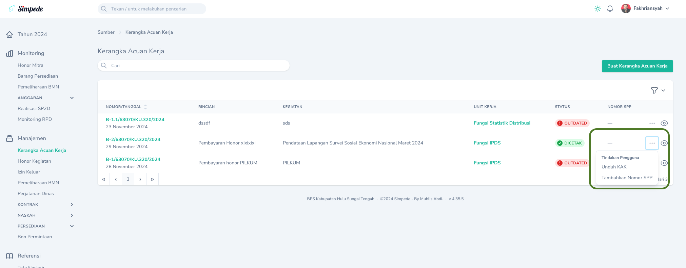
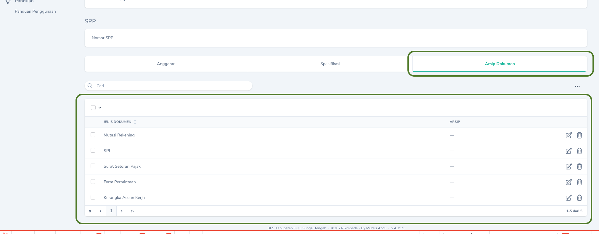
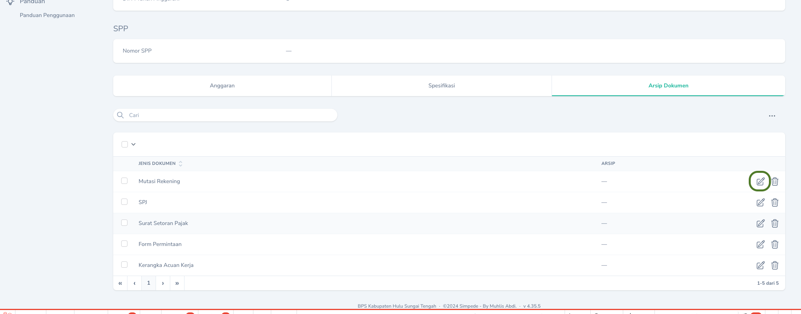
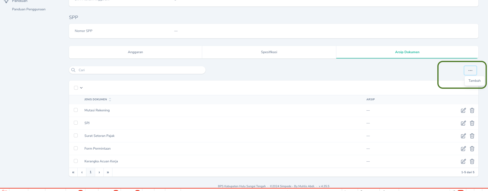

## Kewenangan Pengguna
Arsip yang telah bertanda tangan perlu di scan dan diupload untuk pengarsipan.
Berikut adalah user yang dapat melakukan upload arsip dokumen berdasarkan kewenangan.

| Arsip                 | Pengunggah                            |
| --------              | ------------------------------------- |
| Kerangka Acuan        | Arsiparis                             |
| SPM dan SP2D          | Arsiparis, PPSPM                      |
| Kontrak Mitra         | Arsiparis                             |
| BAST Kontrak Mitra    | Arsiparis                             |
| Naskah Masuk          | Pegawai, Ketua Tim, Kepala, Arsiparis |
| Naskah Keluar         | Pegawai, Ketua Tim, Kepala, Arsiparis |
| Kertas Kerja Reward   | Kasubbag Umum, Arsiparis              |
| SK Reward             | Kasubbag Umum, Arsiparis              |
| Sertifikat Reward     | Kasubbag Umum, Arsiparis              |
| BON Permintaan        | Pengelola Persediaan                  |
| Penerimaan Persediaan | Pengelola Persediaan                  |

## Kerangka Acuan
<Note>
   Menu : `Manajemen` -> `Kerangka Acuan Kerja` 
</Note>
Untuk pengarsipan berkas SPJ terkait Kerangka Acuan Kerja, Arsiparis wajib melakukan 2 hal berikut.
<Steps>
    <Step title="Menambahkan Nomor SPP pada KAK">
        Untuk Menambahkan Nomor SPP, Klik `Tombol Aksi` dan pilih `Tambah Nomor SPP`
        <Frame caption="Menambahkan Nomor SPP pada Kerangka Acuan Kerja">
        
        </Frame>
    </Step>
    <Step title="Mengupload Arsip">
        Upload Arsip KAK dapat dilakukan dengan mengakses `Halaman Detail` Kerangka Acuan lalu mengklik Tab `Arsip Dokumen.
        <Frame caption="Tab Arsip Dokumen">
        
        </Frame>
        Selanjutnya, klik `Tombol Edit` untuk memilih dan mengupload arsip dokumen.
        <Frame caption="Tombol Edit untuk upload arsip">
        
        </Frame>
        <Tip>
            Secara default telah terdapat 5 jenis dokumen yang harus diupload, yaitu:
            1. Mutasi Rekening
            2. SPJ
            3. Surat Setoran Pajak
            4. Form Permintaan
            5. Kerangka Acuan Kerja
        </Tip>
        Jenis dokumen tergantung dari jenis KAK, ada kalanya perlu menambahkan jenis dokumen lainnya. Untuk menambahkan jenis dokumen, klik tombol `Tambah`.
        <Frame caption="Menambah Jenis Dokumen">
        
        </Frame>
    </Step>
</Steps>

## SPM dan SP2D
<Note>
   Menu : `Anggaran` -> `Daftar SP2D` 
   > Gunakan `Tombol Edit` (<Icon icon="pen-to-square" />) untuk mengupload arsip dokumen.
</Note>