## Membuat

<Note>
Daftar Honor Kegiatan tidak bisa ditambahkan secara manual. Daftar ini akan dibuat otomatis apabila terdapat penggunaan anggaran Honor Output Kegiatan pada Kerangka Acuan yang telah dibuat.
</Note>

### Membuat Surat Tugas dan SK

Pembuatan Surat Tugas dan SK dilakukan dengan menekan `Tombol Sunting` pada tabel Honor Kegiatan. Beri ceklis pada pilihan `Buat Surat Tugas` untuk membuat Surat Tugas dan beri ceklis pada pilihan `Buat Surat Keputusan (SK)` untuk membuat SK.

<Frame caption="Ceklis pilihan pembuatan Surat Tugas dan SK">
    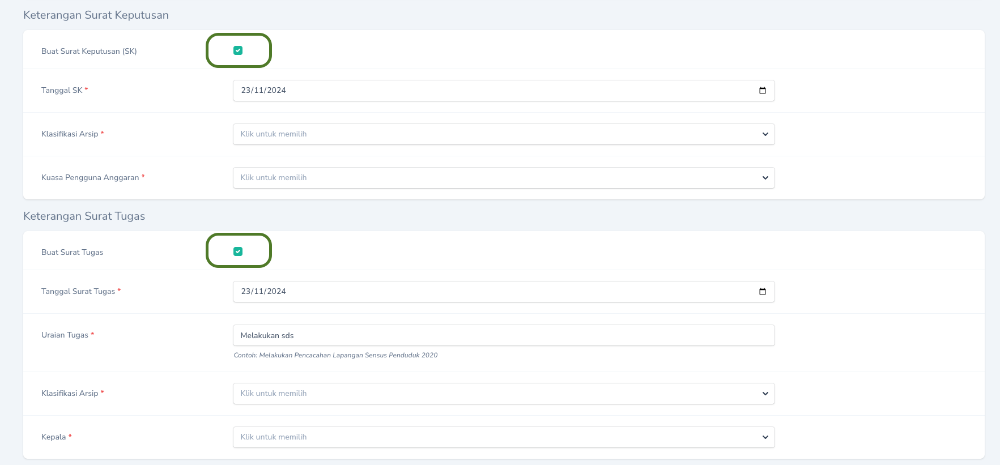
</Frame>

### Menambahkan Daftar Honor

<Note>
Agar dapat melakukan pencetakan SPJ, Surat Tugas maupun SK, terlebih dahulu harus ditambahkan daftar honor mitra atau daftar honor pegawai.
</Note>

<Steps>
  <Step title="Download Template dari BOS">
    Masuk Aplikasi BOS, Pada Halaman Pembuatan Form Permintaan Honor, pilih tombol `Import Peserta`.
    <Frame caption="Tombol `Import Peserta` pada Aplikasi BOS">
    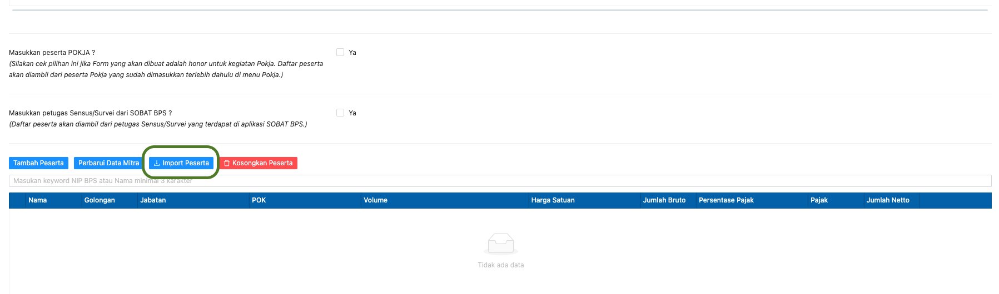
    </Frame>
    Selanjutnya pilih tombol `Download Excel` untuk mendownload template excel yang akan diimport ke dalam aplikasi. Jangan lupa beri ceklis pada pilihan `Sertakan Master Sobat BPS`.
    <Frame caption="Tombol `Download Excel` pada Aplikasi BOS">
    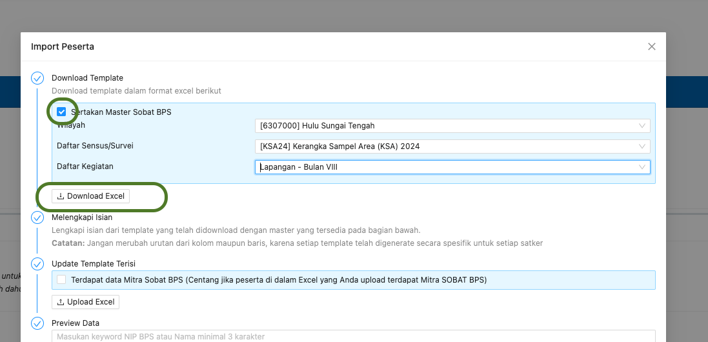
    </Frame>
    <Warning>
      Template Excel harus didownload dari Aplikasi BOS sesuai dengan kegiatannya. Jangan menggunakan template excel kegiatan yang sama tapi dengan periode yang berbeda.
    </Warning>
  </Step>
  <Step title="Tambahkan Daftar Honor Mitra">
   Penambahan Daftar Honor Mitra dapat dilakukan melalui `Halaman Detail` tab `Daftar Honor Mitra` dan memilih aksi `Import dari BOS`.
    <Frame caption="Tombol Aksi `Import dari BOS`">
        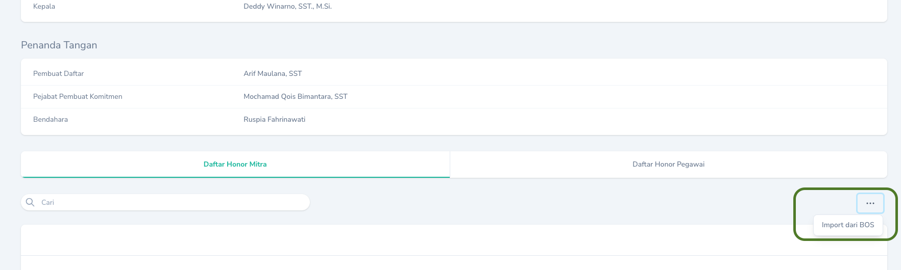
    </Frame>
    <Warning>
      Template Excel yang diimport tidak perlu diisi terlebih dahulu. Langsung import file excel yang telah didownload dari Aplikasi BOS.
    </Warning>
    <Tip>
      Anda dapat menambahkan nilai default jumlah dan harga satuan saat mengimport data dari BOS sehingga tidak perlu mengubah satu per satu daftar honor yang ada. Cukup ubah yang berbeda dengan nilai default saja.
      <Frame caption="Menambahkan default Nilai dan Harga Satuan">
    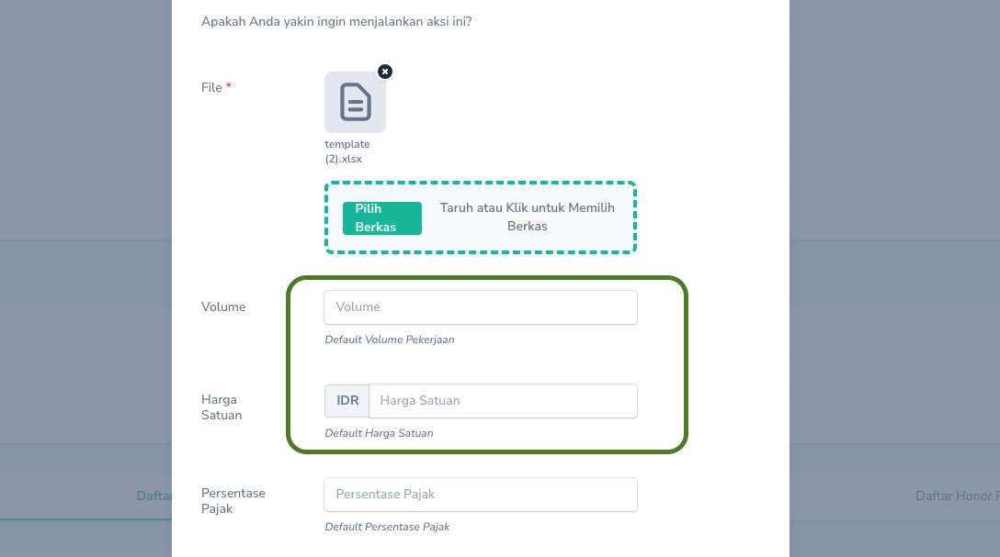
    </Frame>
    </Tip>
    <Warning>
      Sebelum mencetak SPJ, pastikan semua nomor rekening pada daftar honor mitra telah terisi. Apabila masih ada yang kosong, ubah terlebih dahulu dengan menekan `Tombol Aksi` dan pilih `Edit Rekening`.
    <Frame caption="Mengubah Nomor Rekening">
    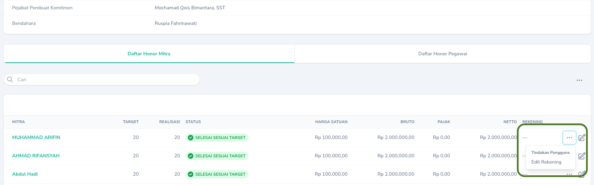
    </Frame>
    </Warning>
  </Step>
  <Step title="Tambahkan Daftar Honor Pegawai">
   Penambahan Daftar Honor Mitra dapat dilakukan melalui `Halaman Detail` tab `Daftar Honor Pegawai` dan memilih tombol `Buat Daftar Honor Pegawai`.
    <Frame caption="Tombol `Buat Daftar Honor Pegawai`">
        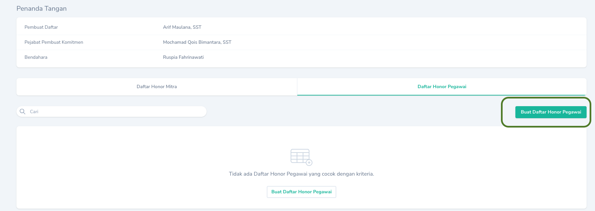
    </Frame>
    <Tip>
      Pegawai yang tidak dibayarkan honornya tetap bisa ditambahkan agar muncul di Surat Tugas dan SK dengan mengosongkan isian jumlah.
      <Frame caption="Menambahkan Pegawai yang tidak dibayarkan honornya">
    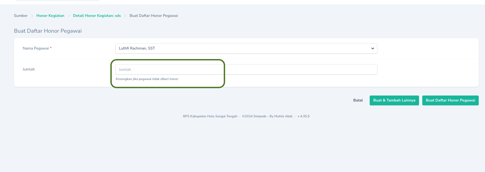
    </Frame>
    </Tip>
    <Warning>
      Jika pegawai menerima honor, sebelum mencetak SPJ, pastikan semua nomor rekening pada daftar honor pegawai telah terisi. Apabila masih ada yang kosong, ubah terlebih dahulu dengan menekan `Tombol Aksi` dan pilih `Edit Rekening`.
    <Frame caption="Mengubah Nomor Rekening">
    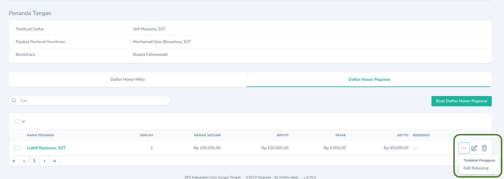
    </Frame>
    </Warning>
  </Step>
</Steps>

## Export Template Untuk Diimport di BOS

Ikuti langkah berikut Untuk menggenerate file excel yang akan digunakan untuk diimport ke Aplikasi BOS.
<Steps>
  <Step title="Export Template BOS">
    Export template Excel dengan menekan `Tombol Aksi` dan pilih `Export Template BOS`.
    <Frame caption="Eksport Template BOS">
        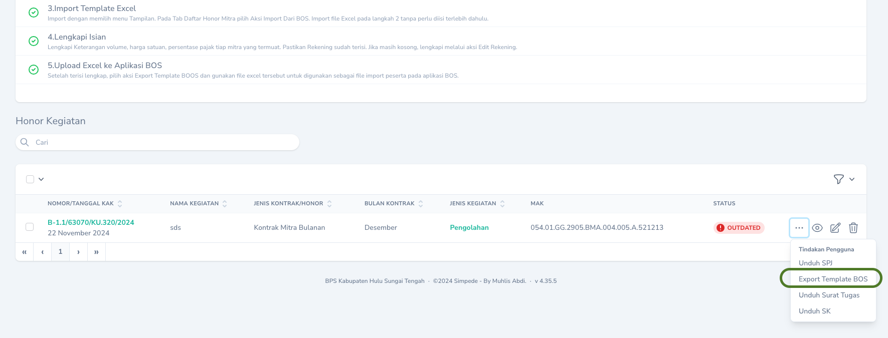
    </Frame>
  </Step>
  <Step title="Import Template pada Aplikasi BOS">
    Upload file excel yang telah diexport ke dalam Aplikasi BOS melalui tombol `Upload Excel`. Jangan lupa memberi ceklis pada pilihan `Terdapat Daftar Mitra SOBAT BPS`.
        <Frame caption="Import pada Aplikasi BOS">
        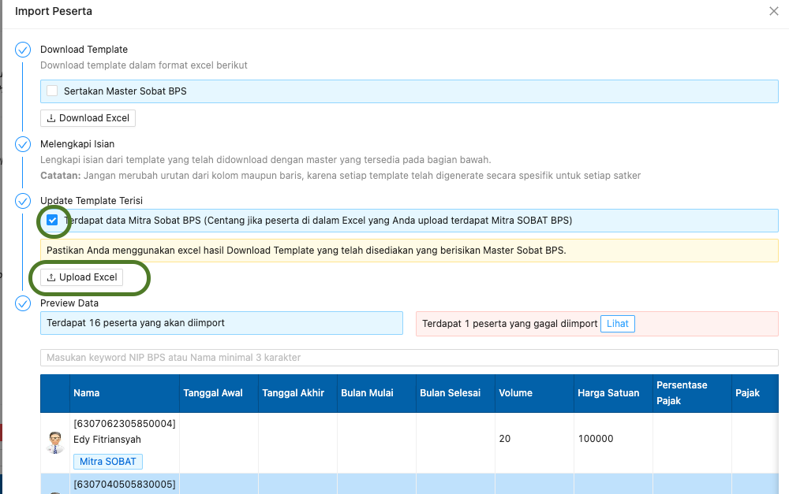
    </Frame>
  </Step>
</Steps>

## Export csv untuk CMS BRI
Ada 2 jenis file csv yang dapat diexportt yaitu untuk transfer ke sesama rekening BRI (Mass FTP) dan transfer ke bank lain (Mass CN). 
Untuk melakukan export, pilih `Tombol Aksi` dan pilih `Export Template CMS BRI MASS FT` atau `Export Template CMS BRI MASS CN`.
  <Frame caption="Export Template CMS BRI">
      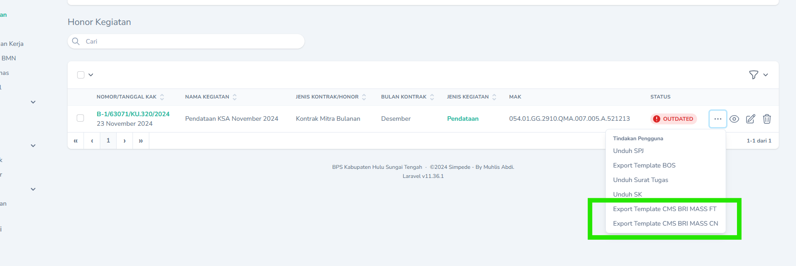
  </Frame>

## Mengubah

Untuk mengubah Honor Kegiatan dapat dilakukan dengan cara menekan `Tombol Sunting` pada record yang akan diubah.

## Menghapus

Untuk menghapus Honor Kegiatan dapat dilakukan dengan cara menekan `Tombol Hapus` pada record yang akan dihapus.

## Mencetak

Pencetakan SPJ, Surat Tugas maupun SK dapat dilakukan dengan cara menekan `Tombol Aksi` pada record yang akan dicetak, kemudian pilih aksi yang sesuai.

<Frame caption="Tampilan Cetak">
    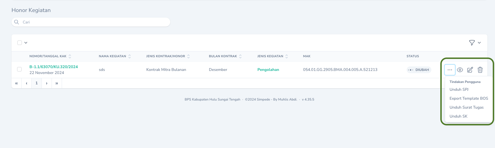
</Frame>

<Tip>
    Anda dapat mengganti nama file yang diunduh.
</Tip>
