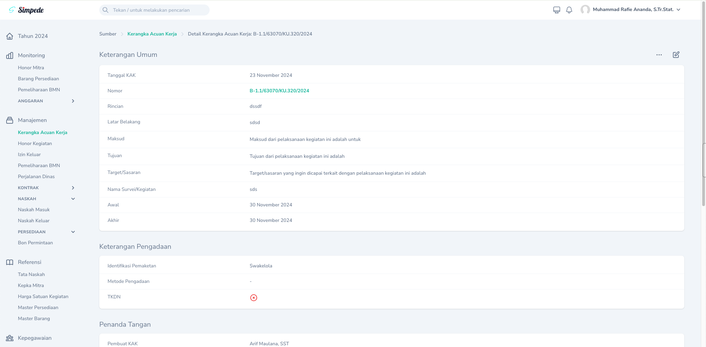

## Fitur
Aplikasi Simpede adalah perangkat lunak yang dirancang untuk menyederhanakan proses ketatausahaan dengan menyediakan fitur-fitur komprehensif yang mencakup:

  <CardGroup cols={2}>
  <Card title="Kerangka Acuan Kerja" icon="square-1">
  1. Pembuatan Kerangka Acuan Kerja
  2. Pembuatan Nomor Form Permintaan
  </Card>
  <Card title="Naskah Dinas" icon="square-2">
  1. Pembuatan Nomor Naskah Keluar
  </Card>
  <Card title="Kepegawaian" icon="square-3">
  1. Kertas Kerja _Employee of the Month_
  2. SK _Employee of the Month_
  3. Sertifikat _Employee of the Month_
  4. Izin Keluar Kantor
  </Card>
  <Card title="Mitra Statistik" icon="square-4">
  1. SPJ Honor
  2. Surat Tugas Mitra
  3. SK Mitra
  4. Kontrak Mitra
  5. BAST Kontrak Mitra
  6. Template CMS BRI
  </Card>
  <Card title="Rapat" icon="square-5">
  1. Undangan
  2. Template Daftar Hadir
  3. Template Notula
  </Card>
  <Card title="Barang Persediaan" icon="square-6">
  1. Pencatatan Persediaan Masuk
  2. Pencatatan Persediaan Keluar
  3. Bon Permintaan Barang Persediaan (Aktualisasi Latsar Hasyimur Rusdi)
  4. Kartu Kendali Persediaan
  </Card>
  <Card title="Pemeliharaan BMN" icon="square-7">
  1. Kartu Kendali Pemeliharaan BMN
  </Card>
  <Card title="Perjalanan Dinas" icon="square-8">
  1. Nomor Surat Tugas
  2. Nomor SPPD
  3. Surat Tugas
  4. SPPD
  5. Kuitansi
  6. Pernyataan tidak menggunakan kendaraan dinas
  </Card>
  <Card title="Dokumentasi" icon="square-9">
  1. Arsip Naskah Masuk, Naskah Keluar, SPJ Keuangan, dll 
  2. Foto kegiatan
  3. Link Penting
  </Card>
  <Card title="Monitoring" icon="square-plus">
  1. Kesesuaian SBML Mitra
  2. Serapan Anggaran
  3. Rencana Penarikan Dana
  </Card>
  <Card title="Kalender" icon="square-plus">
  1. Kalender Kegiatan
  2. Reminder Kegiatan (Aktualisasi Latsar Ilman si Mimin)
  </Card>
  <Card title="Share Link" icon="square-plus">
  1. Share Link SPJ Keuangan untuk Permindok/SPI
  </Card>
  <Card title="Pengelolaan SAKIP" icon="file-chart-column">
  1. Pendokumentasian Realisasi Kinerja
  2. Pendokumentasian Analisis SAKIP
  3. Pendokumentasian Rencana Tindak Lanjut
  4. Pendokumentasian Pelaksanaan Tindak Lanjut
  </Card>

</CardGroup>

## Tombol

Tombol-tombol yang umum digunakan dalam aplikasi.

<CardGroup cols={2}>
  <Card title="Tombol Tampilan" icon={<svg xmlns="http://www.w3.org/2000/svg" fill="none" viewBox="0 0 24 24" stroke-width="1.5" stroke="currentColor" aria-hidden="true" class="w-6 h-6"><path stroke-linecap="round" stroke-linejoin="round" d="M2.036 12.322a1.012 1.012 0 010-.639C3.423 7.51 7.36 4.5 12 4.5c4.638 0 8.573 3.007 9.963 7.178.07.207.07.431 0 .639C20.577 16.49 16.64 19.5 12 19.5c-4.638 0-8.573-3.007-9.963-7.178z"></path><path stroke-linecap="round" stroke-linejoin="round" d="M15 12a3 3 0 11-6 0 3 3 0 016 0z"></path></svg>}>
    Digunakan untuk mengakses Halaman Detail dari suatu Record.
  </Card>

  <Card title="Tombol Sunting" icon={<svg xmlns="http://www.w3.org/2000/svg" fill="none" viewBox="0 0 24 24" stroke-width="1.5" stroke="currentColor" aria-hidden="true" class="w-6 h-6"><path stroke-linecap="round" stroke-linejoin="round" d="M16.862 4.487l1.687-1.688a1.875 1.875 0 112.652 2.652L10.582 16.07a4.5 4.5 0 01-1.897 1.13L6 18l.8-2.685a4.5 4.5 0 011.13-1.897l8.932-8.931zm0 0L19.5 7.125M18 14v4.75A2.25 2.25 0 0115.75 21H5.25A2.25 2.25 0 013 18.75V8.25A2.25 2.25 0 015.25 6H10"></path></svg>}>
    Digunakan untuk mengkases Halaman Edit dari suatu Record.
  </Card>

  <Card title="Tombol Hapus" icon={<svg xmlns="http://www.w3.org/2000/svg" fill="none" viewBox="0 0 24 24" stroke-width="1.5" stroke="currentColor" aria-hidden="true" class="w-6 h-6"><path stroke-linecap="round" stroke-linejoin="round" d="M14.74 9l-.346 9m-4.788 0L9.26 9m9.968-3.21c.342.052.682.107 1.022.166m-1.022-.165L18.16 19.673a2.25 2.25 0 01-2.244 2.077H8.084a2.25 2.25 0 01-2.244-2.077L4.772 5.79m14.456 0a48.108 48.108 0 00-3.478-.397m-12 .562c.34-.059.68-.114 1.022-.165m0 0a48.11 48.11 0 013.478-.397m7.5 0v-.916c0-1.18-.91-2.164-2.09-2.201a51.964 51.964 0 00-3.32 0c-1.18.037-2.09 1.022-2.09 2.201v.916m7.5 0a48.667 48.667 0 00-7.5 0"></path></svg>}>
    Digunakan untuk menghapus suatu Record.
  </Card>

  <Card title="Tombol Aksi" icon={<svg xmlns="http://www.w3.org/2000/svg" fill="none" viewBox="0 0 24 24" stroke-width="1.5" stroke="currentColor" aria-hidden="true" class="w-6 h-6"><path stroke-linecap="round" stroke-linejoin="round" d="M6.75 12a.75.75 0 11-1.5 0 .75.75 0 011.5 0zM12.75 12a.75.75 0 11-1.5 0 .75.75 0 011.5 0zM18.75 12a.75.75 0 11-1.5 0 .75.75 0 011.5 0z"></path></svg>}>
    Digunakan untuk menampilkan aksi-aksi yang bisa dilakukan terhadap suatu Record.
  </Card>

  <Card title="Tombol Filter" icon={<svg xmlns="http://www.w3.org/2000/svg" fill="none" viewBox="0 0 24 24" stroke-width="1.5" stroke="currentColor" aria-hidden="true" class="w-6 h-6"><path stroke-linecap="round" stroke-linejoin="round" d="M12 3c2.755 0 5.455.232 8.083.678.533.09.917.556.917 1.096v1.044a2.25 2.25 0 01-.659 1.591l-5.432 5.432a2.25 2.25 0 00-.659 1.591v2.927a2.25 2.25 0 01-1.244 2.013L9.75 21v-6.568a2.25 2.25 0 01-.659-1.591L3.659 7.409A2.25 2.25 0 013 5.818V4.774c0-.54.384-1.006.917-1.096A48.32 48.32 0 0112 3z"></path></svg>}>
   Digunakan untuk memfilter record pada tabel Halaman Indeks.
  </Card>

  <Card title="Tombol Notifikasi" icon={<svg xmlns="http://www.w3.org/2000/svg" fill="none" viewBox="0 0 24 24" stroke-width="1.5" stroke="currentColor" aria-hidden="true" class="w-6 h-6"><path stroke-linecap="round" stroke-linejoin="round" d="M14.857 17.082a23.848 23.848 0 005.454-1.31A8.967 8.967 0 0118 9.75v-.7V9A6 6 0 006 9v.75a8.967 8.967 0 01-2.312 6.022c1.733.64 3.56 1.085 5.455 1.31m5.714 0a24.255 24.255 0 01-5.714 0m5.714 0a3 3 0 11-5.714 0"></path></svg>}>
   Untuk melihat notifikasi masuk.
  </Card>

</CardGroup>

## Tombol Salin
Beberapa _resource_ memiliki fitur membuat Copy/Salinan sehingga tidak perlu mengisi dari awal semua data. Tombol salin dapat diakses melalui `Tombol Aksi` -> `Buat Salinan`
<Frame caption="Tampilan Membuat Salinan">
  
</Frame>

## Halaman

Halaman-Halaman yang ada pada website.

### Halaman Index
Halaman index adalah tampilan halaman awal yang berisi record-record yang ditampilkan dalam sebuah tabel.
<Frame caption="Tampilan Halaman Indeks">
  
</Frame>

### Halaman Detail
Halaman detail adalah tampilan halaman yang berisi keterangan detail dari suatu record. Semua informasi tentang suatu record akan ditampilkan pada halaman ini.
<Frame caption="Tampilan Halaman Detail">
  
</Frame>

### Halaman Edit
Halaman edit adalah tampilan halaman yang berisi form untuk mengedit record.
<Frame caption="Tampilan Halaman Edit">
  
</Frame>
