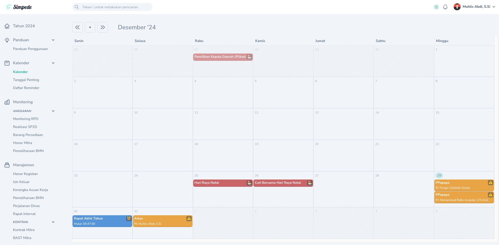
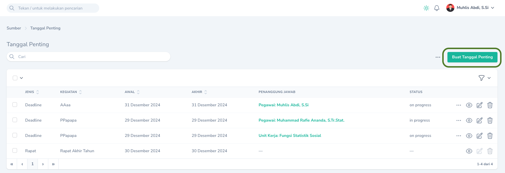
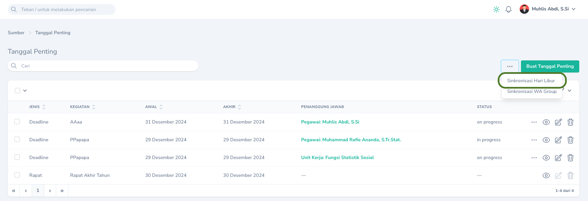
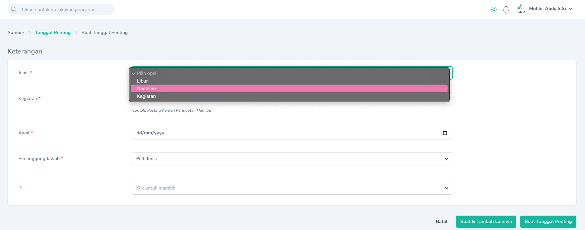
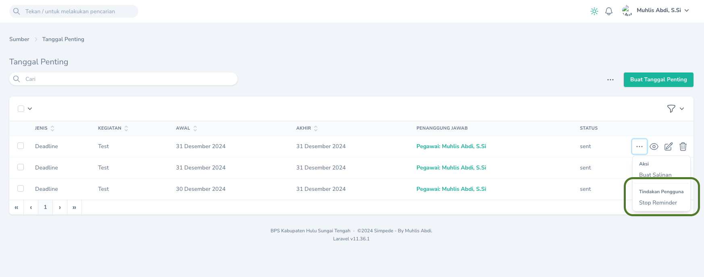

## Kalender Kegiatan

Kalender Kegiatan dapat dilihat melalui Menu `Kalender` -> `Kalender`
<Frame caption="Tampilan Kalender Kegiatan">
    
</Frame>

### Menambahkan Kegiatan

Untuk menambahkan kegiatan yang akan ditampilkan pada Kalender Kegiatan, dapat dilakukan melalui Menu `Kalender` -> `Tanggal Penting` dan pilih `Buat Tanggal Penting`.
Terdapat 4 jenis kegiatan yang dapat ditampilkan:
1. Rapat Internal
2. Hari Libur
3. Kegiatan
4. Deadline
<Frame caption="Tampilan Menambahkan Kegiatan">
    
</Frame>
<Note>
    Rapat Internal hanya dapat ditambahkan secara otomatis apabila ada Rapat Internal yang dibuat melalui menu `Rapat Internal`.
</Note>
<Tip>
    `Hari Libur` dapat ditambahkan secara otomatis melalui `Tombol Aksi` `Sinkronisasi Hari Libur` pada `Halaman Index` `Tanggal Penting`.
    <Frame caption="Aksi Sinkronisasi Hari Libur">
    
</Frame>
</Tip>

## Reminder

### Menambahkan Reminder

Reminder secara otomatis akan ditambahkan pada saat Anda membuat Tanggal Penting dengan jenis `Deadline`.
<Frame caption="Tampilan Menambahkan Tanggal Penting Berjenis Deadline">
    
</Frame>
<Note>
    Pada saat membuat Tanggal Penting dengan jenis `Deadline`, untuk menambahkan daftar Group Whatsapp target pengiriman reminder, dapat dilakukan dengan:
    1. Tambahkan nomor pengirim reminder sebagai anggota pada group Whatsapp target pengiriman.
    2. Hubungi Admin untuk melakukan sinkronisasi daftar group.
</Note>
<Warning>
    Hanya Untuk Admin:
    1. Sinkronisasi daftar Group Whatsaap dapat mengakibatkan nomor sender reminder di banned oleh whatsapp. Lakukan sinkronisasi seminimal mungkin.
    2. Sinkronisasi dapat dilakukan melalui `Tombol Aksi` `Sinkronisasi WA Group` pada `Halaman Index` `Tanggal Penting`. 
</Warning>

### Menghentikan Reminder
Reminder akan otomatis berhenti dikirimkan apabila statusnya sudah `sent`. Untuk menghentikan reminder secara manual dapat dilakukan melalui `Tombol Aksi` `Stop Reminder` pada `Halaman Index` `Tanggal Penting`.
<Frame caption="Tampilan Stop Reminder">
    
</Frame>
