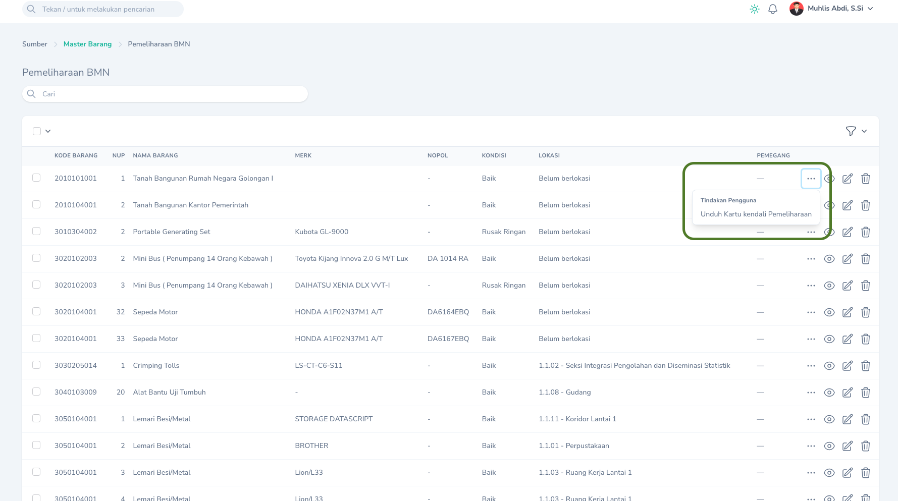
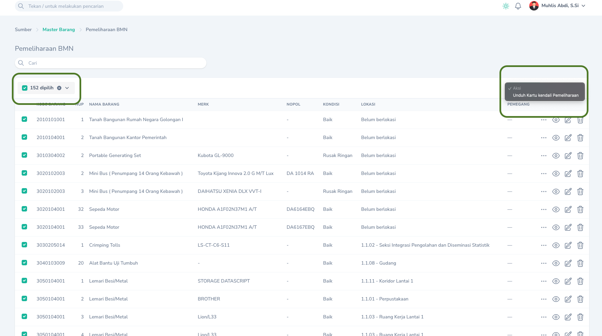

## Mencetak Kartu Kendali

Pencetakan Kartu Kendali Pemeliharaan BMN dapat dilakukan melalui menu `Monitoring` -> `Pemeliharaan BMN` Klik `Tombol Aksi` pada pemeliharaan BMN yang ingin dicetak Kartu Kendalinya kemudian pilih `Unduh Kartu Kendali Pemeliharaan`.
<Frame caption="Tampilan Cetak Kartu Kendali Pemeliharaan">
    
</Frame>

## Mencetak Sekaligus
<Tip>
    Anda dapat mencetak sekaligus beberapa kartu kendali pemeliharaan BMN dan mengunduhnya dalam satu file.
<Frame caption="Cetak sekaligus kartu kendali pemeliharaan BMN">
    
</Frame>
</Tip>

