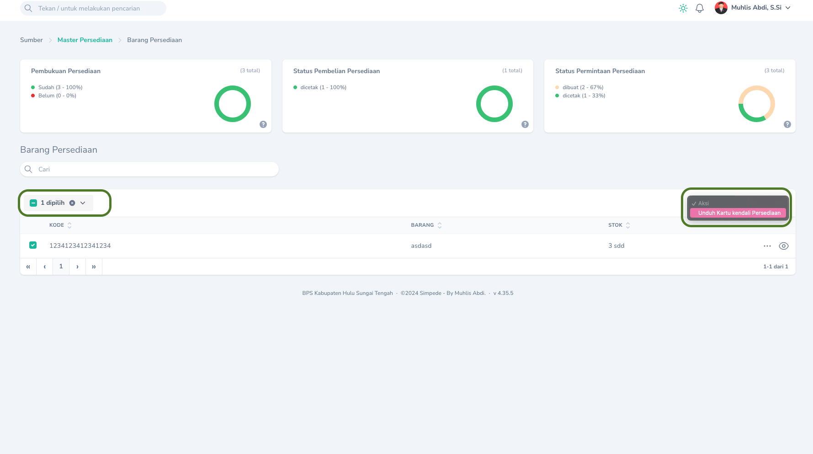

## Mencetak Kartu Kendali

Pencetakan Kartu Kendali Barang Persediaan dapat dilakukan melalui menu `Monitoring` -> `Barang Persediaan` Klik `Tombol Aksi` pada barang persediaan yang ingin dicetak Kartu Kendalinya kemudian pilih `Unduh Kartu Kendali Persediaan`.
<Frame caption="Tampilan Cetak Kartu Kendali Persediaan">
    
</Frame>

## Mencetak Sekaligus
<Tip>
    Anda dapat mencetak sekaligus beberapa kartu kendali barang persediaan dan mengunduhnya dalam satu file.
<Frame caption="Cetak sekaligus kartu kendali barang persediaan">
    
</Frame>
</Tip>

