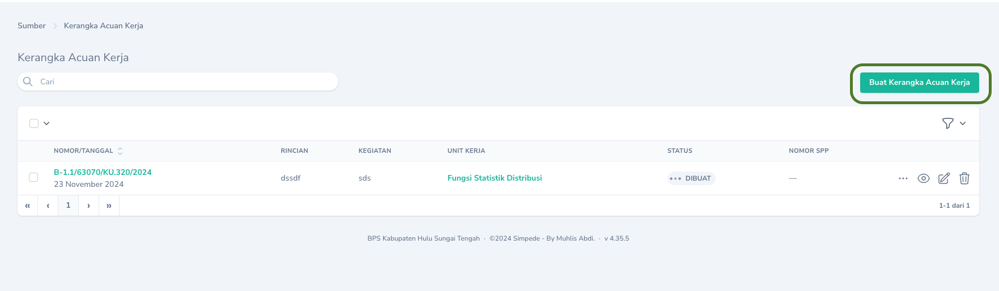
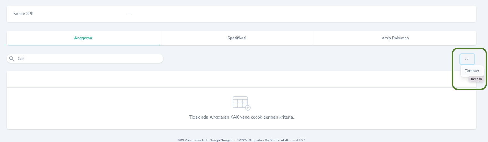
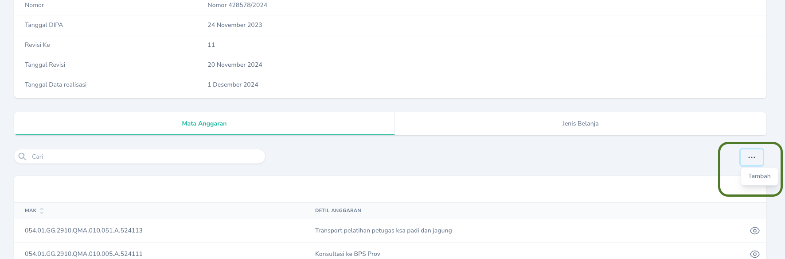
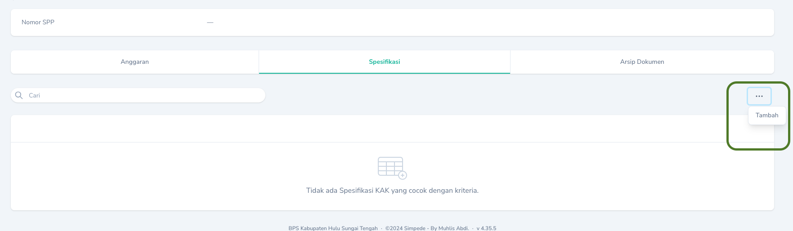
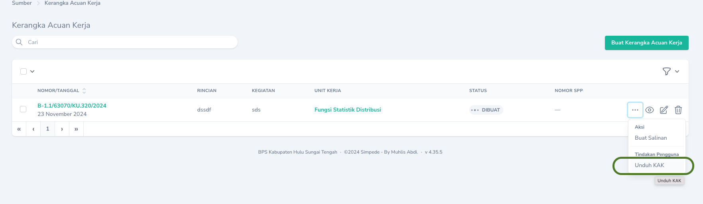

## Membuat

Untuk membuat Kerangka Acuan Kerja, buka Halaman Indeks dan klik tombol `Buat Kerangka Acuan Kerja` yang terdapat di bagian kanan tabel.

<Frame caption="Tampilan Menambahkan Kerangka Acuan">
    
</Frame>

<Warning>
    Kerangka Acuan Kerja bukan menerangkan tentang kegiatan permintaan pembayaran. Kerangka Acuan Kerja berisi informasi tentang detail kegiatan yang akan dimintakan pembayarannya.
</Warning>

<Tip>
    `Tanggal Awal` dan `Tanggal Akhir` pada Kerangka Acuan Kerja adalah tanggal dimulainya dan berakhirnya kegiatan yang akan dimintakan pembayarannya.
</Tip>

<Warning>
    Untuk mencetak Kerangka Acuan Kerja, harus ditambahkan terlebih dahulu Mata Anggaran dan Spesifikasi.
</Warning>

### Menambahkan Mata Anggaran

Untuk menambahkan Mata Anggaran, buka `Halaman Detail` pada Kerangka Acuan Kerja yang akan ditambahkan Mata Anggarannya. Kemudian pada Tab `Anggaran`, pilih Aksi `Tambah`.
<Frame caption="Tampilan Menambahkan Mata Anggaran">
    
</Frame>

<Warning>
    Menghapus Mata Anggaran yang telah ditambahkan akan menghapus Daftar Honor Kegiatan, Daftar Pembelian Persediaan, dan Daftar Pemeliharaan BMN yang bersesuaian.
</Warning>

### Menambahkan Mata Anggaran yang Belum Ada di POK

Ada kalanya kita perlu membuat Kerangka Acuan terlebih dahulu meskipun anggaran yang akan digunakan belum ada di POK. Untuk menambahkan anggaran yang belum ada di POK, pilih menu `Anggaran` lalu pilih `DIPA`. Pada `Halaman Detail` DIPA, pilih tab `Mata Anggaran`. Selanjutnya pilih `Tombol Aksi` di pojok kanan atas tabel `Mata Anggaran` dan pilih aksi `Tambah`. 
<Frame caption="Tampilan Menambahkan Mata Anggaran yang belum ada di POK">
    
</Frame>

### Matching Anggaran

Setelah revisi anggaran terbit, Anggaran yang sebelumnya belum ada di POK dan telah ditambahkan secara manual perlu dilakukan pencocokan. Menu pencocokan dapat diakses melalui menu `Anggaran` -> `Matching Anggaran`
<Warning>
    Matching anggaran hanya dapat dilakukan sekali dalam satu akun dan tidak dapat dimatching ulang jika terjadi kesalahan. Pastikan untuk memilih anggaran yang benar-benar sesuai.
</Warning>
### Menambahkan Spesifikasi

Untuk menambahkan Spesifikasi, buka `Halaman Detail` pada Kerangka Acuan Kerja yang akan ditambahkan Spesifikasinya. Kemudian pada Tab `Spesifikasi`, pilih Aksi `Tambah`.
<Frame caption="Tampilan Menambahkan Spesifikasi">
    
</Frame>

## Mengubah

Untuk mengubah Kerangka Acuan Kerja, klik `Tombol Sunting` pada record yang akan diubah.

## Menghapus

Untuk menghapus Kerangka Acuan Kerja, klik `Tombol Hapus` pada record yang akan dihapus.

## Mencetak

Untuk mencetak Kerangka Acuan Kerja, klik `Tombol Aksi` pada record yang akan dicetak, kemudian pilih `Unduh KAK`.

<Frame caption="Tampilan Cetak KAK">
    
</Frame>

<Tip>
    Anda dapat mengganti nama file KAK yang diunduh.
</Tip>
