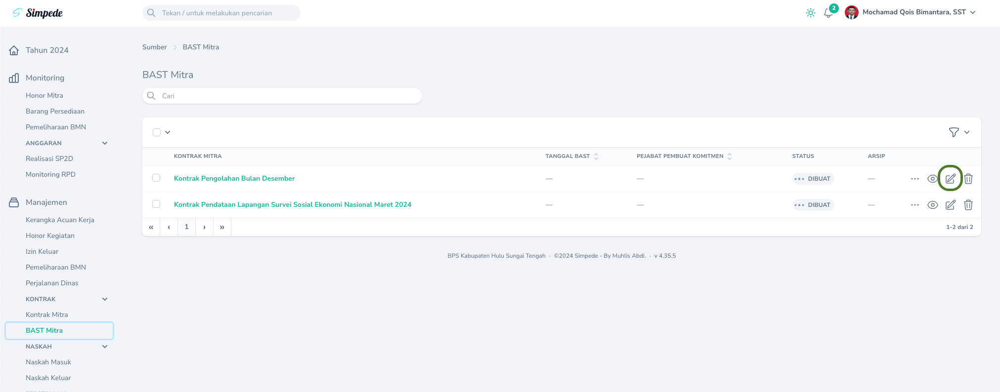
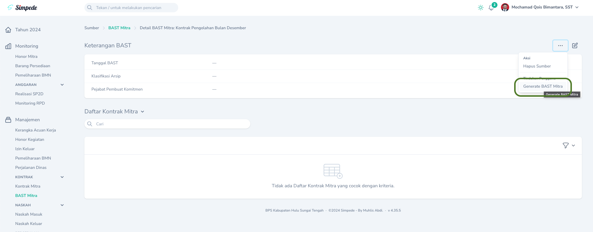
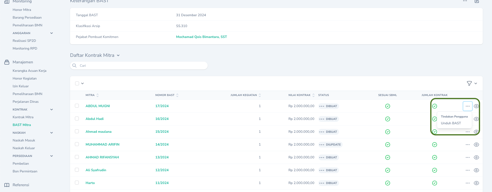
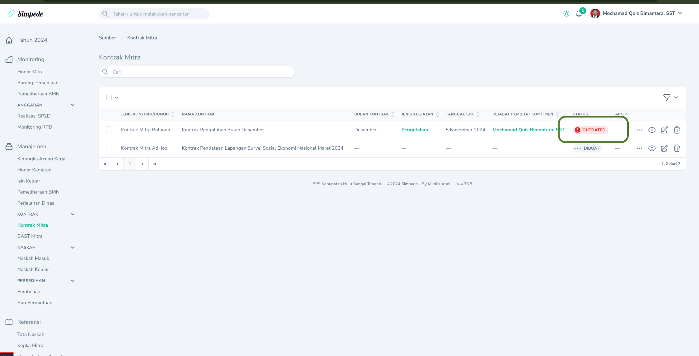
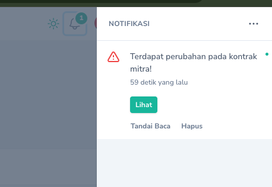
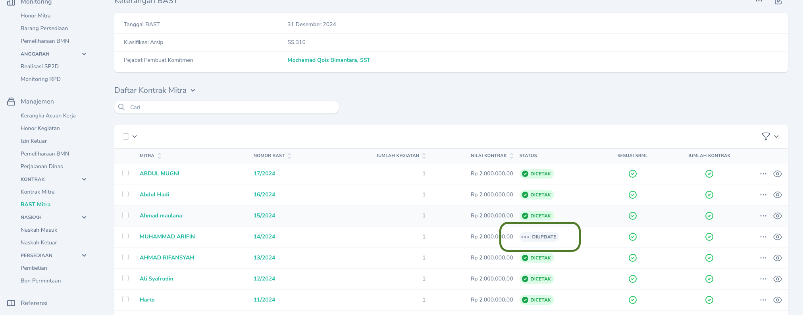

## Membuat

<Note>
Daftar BAST Kontrak Mitra tidak bisa ditambahkan secara manual. Daftar ini akan dibuat otomatis apabila terdapat penggunaan anggaran honor output kegiatan dengan jenis kontrak berupa Kontrak Bulanan dan Kontrak Adhoc.
</Note>

## Generate BAST
Untuk menggenerate BAST Kontrak Mitra dapat dilakukan dengan langkah-langkah sebagai berikut:
<Steps>
    <Step title="Edit Keterangan BAST">
    Sebelum dapat menggenerate BAST, terlebih dahulu keterangan BAST harus diubah. Untuk mengubah BAST dapat dilakukan melalui menu `Kontrak Mitra` -> `BAST` kemudian klik `Tombol Sunting` pada record yang akan diubah.
    <Frame caption="Edit Data BAST Kontrak Mitra">
        
    </Frame>
  </Step>

<Step title="Generate BAST Kontrak Mitra">
    Buka `Halaman Detail` BAST Mitra, lalu klik `Tombol Aksi` dan pilih `Generate BAST Mitra`.
    <Frame caption="Generate BAST Kontrak Mitra">
        
    </Frame>
  </Step>
</Steps>

## Cetak BAST
Untuk Mencetak BAST dapat dilakukan melalui `Halaman Detail` BAST Mitra, pada tabel `Daftar Kontrak Mitra`, klik `Tombol Aksi` pada record yang akan dicetak kemudian pilih `Unduh BAST`.
    <Frame caption="Unduh BAST Kontrak Mitra">
        
    </Frame>
## Cetak Sekaligus
<Tip>
    Anda dapat mencetak sekaligus beberapa BAST dan mengunduhnya dalam satu file.
<Frame caption="Cetak sekaligus BAST kontrak mitra">
    
</Frame>
</Tip>

## Regenerate BAST
<Warning>
    Ada kalanya terdapat perubahan data kontrak yang dilakukan oleh ketua tim. Jika ini terjadi, maka BAST yang sudah di generate sebelumnya perlu di regenerate. BAST yang perlu diregenerate ditandai dengan status `Outdated`.
    <Frame caption="BAST Outdated">
    
</Frame>
Selain itu, Pejabat Pembuat Komitmen juga akan mendapatkan notifikasi perubahan data kontrak.
  <Frame caption="Notifikasi perubahan data kontrak">
    
</Frame>
</Warning>

Daftar BAST yang mengalami perubahan setelah diregenerate ditandai dengan status `Diupdate` sehingga perlu dicetak ulang.
  <Frame caption="Daftar BAST yang berubah setelah regenerate">
    
</Frame>

## Mengubah

Untuk mengubah BAST Kontrak Mitra dapat dilakukan dengan cara menekan `Tombol Sunting` pada record yang akan diubah.

## Menghapus

Untuk menghapus BAST Kontrak Mitra dapat dilakukan dengan cara menekan `Tombol Hapus` pada record yang akan dihapus.
