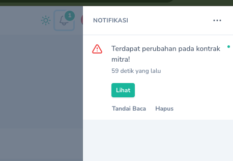

## Membuat

<Note>
Daftar Kontrak Mitra tidak bisa ditambahkan secara manual. Daftar ini akan dibuat otomatis apabila terdapat penggunaan anggaran honor output kegiatan dengan jenis kontrak berupa Kontrak Bulanan dan Kontrak Adhoc.
</Note>

## Generate Kontrak
Untuk menghasilkan Kontrak Mitra dapat dilakukan dengan langkah-langkah sebagai berikut:
<Steps>
    <Step title="Edit Keterangan Kontrak">
    Sebelum dapat menghasilkan kontrak, terlebih dahulu keterangan kontrak harus diubah. Untuk mengubah kontrak dapat dilakukan melalui menu `Kontrak Mitra` -> `Kontrak` kemudian klik `Tombol Sunting` pada record yang akan diubah.
    <Frame caption="Edit Data Kontrak Mitra">
        
    </Frame>
  </Step>

<Step title="Generate Kontrak Mitra">
    Buka `Halaman Detail` Kontrak Mitra, lalu klik `Tombol Aksi` dan pilih `Generate Kontrak`.
    <Frame caption="Generate Kontrak Mitra">
        
    </Frame>
  </Step>
</Steps>

## Cetak Kontrak
Untuk Mencetak Kontrak dapat dilakukan melalui `Halaman Detail` Kontrak Mitra, pada tabel `Daftar Kontrak Mitra`, klik `Tombol Aksi` pada record yang akan dicetak kemudian pilih `Unduh Kontrak`.
    <Frame caption="Unduh Kontrak Mitra">
        
    </Frame>
## Cetak Sekaligus
<Tip>
    Anda dapat mencetak sekaligus beberapa kontrak dan mengunduhnya dalam satu file.
<Frame caption="Cetak sekaligus kontrak mitra">
    
</Frame>
</Tip>

## Regenerate Kontrak
<Warning>
    Ada kalanya terdapat perubahan data kontrak yang dilakukan oleh ketua tim. Jika ini terjadi, maka kontrak yang sudah di generate sebelumnya perlu di regenerate. Kontrak yang perlu diregenerate ditandai dengan status `Outdated`.
    <Frame caption="Kontrak Outdated">
    
</Frame>
Selain itu, Pejabat Pembuat Komitmen juga akan mendapatkan notifikasi perubahan data kontrak.
  <Frame caption="Notifikasi perubahan data kontrak">
    
</Frame>
</Warning>

Daftar kontrak yang mengalami perubahan setelah diregenerate ditandai dengan status `Diupdate` sehingga perlu dicetak ulang.
  <Frame caption="Daftar Kontrak yang berubah setelah regenerate">
    
</Frame>

## Mengubah

Untuk mengubah Kontrak Mitra dapat dilakukan dengan cara menekan `Tombol Sunting` pada record yang akan diubah.

## Menghapus

Untuk menghapus Kontrak Mitra dapat dilakukan dengan cara menekan `Tombol Hapus` pada record yang akan dihapus.
