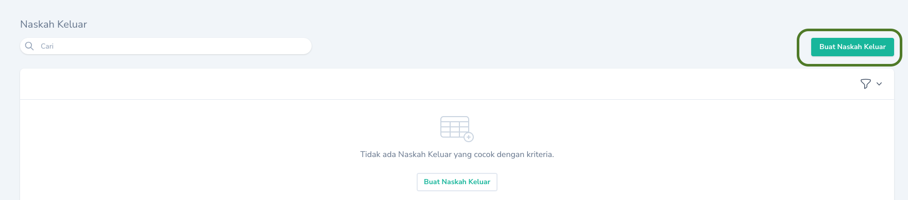
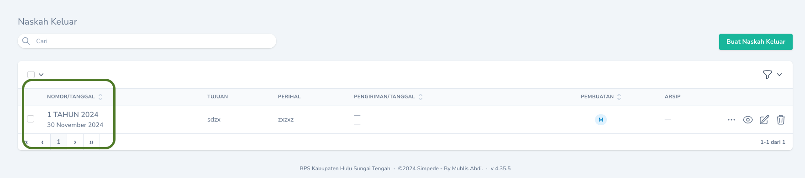

<Note>
Tidak semua naskah keluar harus dimintakan nomor naskahnya. Ada beberapa jenis naskah yang penomorannya sudah dibuat secara otomatis. Naskah tersebut adalah Kerangka Acuan Kerja, Surat Tugas dan SK Honor Kegiatan, Kontrak Mitra, BAST Mitra, Bon Permintaan, Keterangan Serah Terima Barang Persediaan, Surat Tugas dan Surat Perintah Perjalanan Dinas, serta Sertifikat dan Surat Keputusan _Employee of the Month_.
</Note>

## Membuat

Pembuatan Nomor Naskah Keluar dapat dilakukan melalui menu `Naskah Keluar`. Pada Halaman Indeks tekan tombol `Buat Naskah Keluar` yang terdapat pada bagian kanan tabel.

<Frame caption="Tampilan Membuat Nomor Naskah Keluar">
    
</Frame>

Nomor Naskah Keluar yang dibulat dapat dilihat pada `Halaman Indeks`

<Frame caption="Tampilan Nomor Naskah Keluar yang telah berhasil dibuat">
    
</Frame>

## Mengubah

Untuk mengubah Naskah Keluar dapat dilakukan dengan cara menekan `Tombol Sunting` pada record yang akan diubah.

## Menghapus

Untuk menghapus Naskah Keluar dapat dilakukan dengan cara menekan `Tombol Hapus` pada record yang akan dihapus.