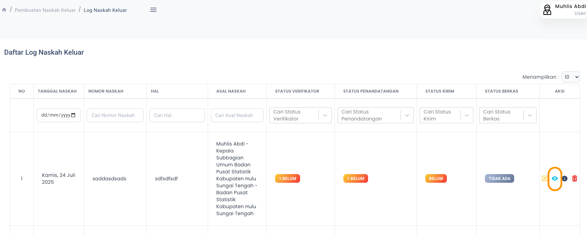

<Warning>
Untuk kontinuitas penomoran, permintaan nomor naskah keluar tetap dimintakan melalui aplikasi SIMPEDE. Nomor yang diperoleh lalu diinput manual pada aplikasi SRIKANDI
</Warning>
<Note>
Tidak semua naskah keluar harus dimintakan nomor naskahnya. Ada beberapa jenis naskah yang penomorannya sudah dibuat secara otomatis. Naskah tersebut adalah:
1. Kerangka Acuan Kerja, 
2. Surat Tugas Honor Kegiatan
3. SK Honor Kegiatan, 
4. Kontrak Mitra, 
5. BAST Mitra, 
6. Bon Permintaan Barang Persediaan,
7. Keterangan Serah Terima Barang Persediaan, 
8. Surat Tugas Perjalanan Dinas
9. Surat Perintah Perjalanan Dinas,
10. Undangan Rapat Internal,
11. Sertifikat _Employee of the Month_.
12. Surat Keputusan _Employee of the Month_.
</Note>

## Membuat

Pembuatan Nomor Naskah Keluar dapat dilakukan melalui menu `Naskah Keluar`. Pada Halaman Indeks klik tombol `Buat Naskah Keluar` yang terdapat pada bagian kanan tabel.

<Frame caption="Tampilan Membuat Nomor Naskah Keluar">
    
</Frame>

Nomor Naskah Keluar yang dibuat dapat dilihat pada `Halaman Indeks`

<Frame caption="Tampilan Nomor Naskah Keluar yang telah berhasil dibuat">
    
</Frame>

## Pengiriman Melalui Aplikasi Srikandi
Untuk mengirimkan Naskah Keluar melalui Aplikasi Srikandi, ikuti langkah berikut:
<Steps>
<Step title="Unduh Template Surat Keluar dan Sesuaikan isinya">
    Tautan Unduh Template: [Template Surat Keluar](https://simpede.my.id/storage/templates/naskah/ZIzQoGAbh6uOQXjJ5sbZdog42wVlKyBepLjIWEve.docx).
    <Warning>
        Jangan menghapus atau mengubah bagian berikut.
        <Frame caption="Tampilan Menu Naskah Keluar">
            
        </Frame>
    </Warning>
</Step>
<Step title="Masuk ke Aplikasi Srikandi">
    Buka aplikasi Srikandi [Srikandi](https://srikandi.arsip.go.id/) dan masuk ke akun Anda.
</Step>
<Step title="Pilih Menu Naskah Keluar -> Registrasi Naskah Keluar">
<Frame caption="Tampilan Menu Naskah Keluar">
    
</Frame>
</Step>
<Step title="Isi Bagian Keterangan Naskah Keluar">
    <Frame caption="Detail Naskah Keluar">
        
    </Frame>
    <Frame caption="Detail Naskah Keluar">
        
    </Frame>
    <Tip>
        Pilihan Pengisian:
        1. Tipe Form: **Naskah Keluar**
        2. Dikirimkan Melalui: **Badan Pusat Statistik Kabupaten Hulu Sungai Tengah**
        3. Jenis Naskah: **Surat DInas Daerah**
        4. Nomor Naskah: **Isikan nomor naskah yang telah dibuat di Simpede**
        5. Hal: **Isikan hal surat sesuai yang telah dibuat di Simpede**
        6. Isi Ringkas: **Salin dari detail naskah keluar di Simpede**
        <Frame caption="Detail Naskah Keluar">
            
        </Frame>
        7. File Naskah: **Unggah file template surat yang telah disesuaikan isinya**
        8. Lampiran Naskah: **Jika ada, unggah file lampiran yang relevan**
        9. Utama (Internal / Eksternal Srikandi): **Pilih Tujuan Surat**
        10. Tembusan (Internal / Eksternal Srikandi): **Pilih Tembusan Surat jika ada**
        11. Verifikator: **Pilih Kasubbag Umum**
        12. Penandatangan: **Pilih Kepala BPS Kabupaten Hulu Sungai Tengah**
        13. Tipe Tanda Tangan: **Pilih Elektronik**
        14. Visual TTE : **Pilih QR Code**
    </Tip>
    Kemudian Klik tombol `Simpan`.
</Step>
<Step title="Kirim Naskah Keluar">
    Buka Menu `Naskah Keluar` -> `Log Naskah Keluar`, lalu cari naskah yang telah dibuat. Klik `Tombol Lihat` (Ikon Mata) pada record tersebut dan pilih `Kirim Naskah`.
    <Frame caption="Proses Kirim">
        
    </Frame>
    Selanjutnya klik Tombol `Kirim Konsep` .
    <Frame caption="Proses Kirim">
        
    </Frame>
</Step>
</Steps>
## Mengubah

Untuk mengubah Naskah Keluar, klik `Tombol Sunting` pada record yang akan diubah.

## Menghapus

Untuk menghapus Naskah Keluar, klik `Tombol Hapus` pada record yang akan dihapus.
