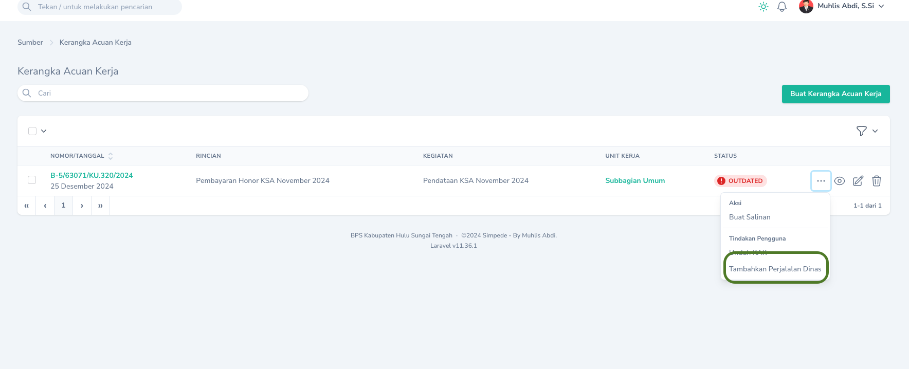
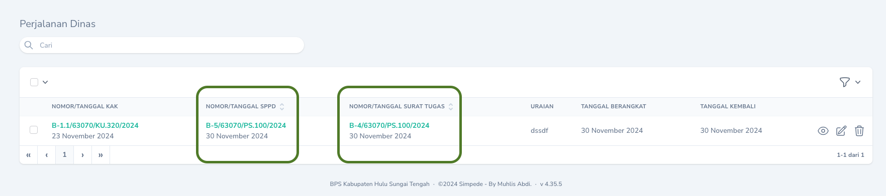
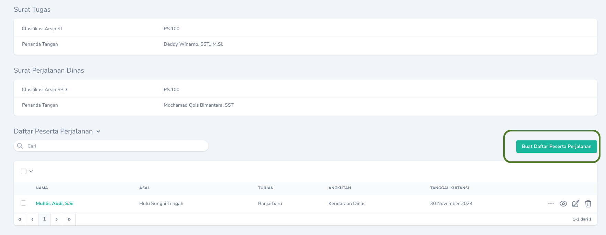
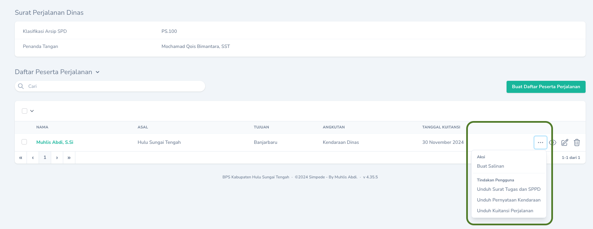

## Membuat

Daftar Perjalanan Dinas bisa ditambahkan jika terdapat anggaran perjalanan pada Kerangka Acuan Kerja. Untuk menambahkan perjalanan dinas, pada `Halaman Indeks` Kerangka Acuan, klik `Tombol Aksi` dan pilih `Tambahkan Perjalanan Dinas`.
<Frame caption="Tampilan Menambahkan Perjalanan Dinas">
    
</Frame>

<Info>
Satu perjalanan dinas hanya untuk tujuan, tanggal berangkat dan tanggal pulang yang sama. Apabila berbeda silakan tambahkan perjalanan dinas baru
</Info>

### Membuat Nomor

Untuk membuat nomor Surat Tugas dan Surat Perintah Perjalanan Dinas, dapat dilakukan dengan cara menekan  `Tombol Sunting` pada record yang akan dibuat nomornya. Lengkapi Semua isian yang diperlukan.

Nomor Surat Tugas dan Surat Perintah Perjalanan Dinas yang dibuat dapat dilihat pada `Halaman Indeks`

<Frame caption="Tampilan Nomor Surat Tugas dan Surat Perintah Perjalanan Dinas">
    
</Frame>

### Menambahkan Daftar Peserta

<Warning>
    Untuk saat ini, fitur hanya dapat digunakan untuk jenis `Perjalanan Dinas Biasa`
</Warning>

<Note>
Daftar Peserta perlu ditambahkan apabila ingin mencetak Surat Tugas, Surat Perintah Perjalanan Dinas, Kuitansi dan Pernyataan Tidak Menggunakan Kendaraan Dinas.
</Note>

Penambahan Daftar Peserta dapat dilakukan melalui `Halaman Detail` Perjalanan Dinas dan menekan `Buat Daftar Peserta Perjalanan`.

<Frame caption="Tampilan Penambahan Peserta Perjalanan Dinas">
    
</Frame>

### Mencetak
<Warning>
    Untuk saat ini, fitur hanya dapat digunakan untuk jenis `Perjalanan Dinas Biasa`
</Warning>

Pencetakan Surat Tugas, Surat Perintah Perjalanan Dinas, Kuitansi dan Pernyataan Tidak Menggunakan Kendaraan Dinas dapat dilakukan melalui `Halaman Detail` Perjalanan Dinas. Klik `Tombol Aksi` pada tabel `Daftar Peserta Perjalanan` dan pilih jenis dokumen yang ingin dicetak.

<Frame caption="Tampilan Pilihan Cetak">
    
</Frame>

## Mengubah

Untuk mengubah Perjalanan Dinas dapat dilakukan dengan cara klik `Tombol Sunting` pada record yang akan diubah.

## Menghapus

Untuk menghapus Perjalanan Dinas dapat dilakukan dengan cara klik `Tombol Hapus` pada record yang akan dihapus.
