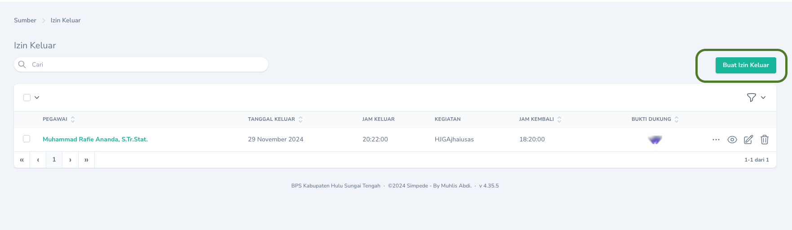
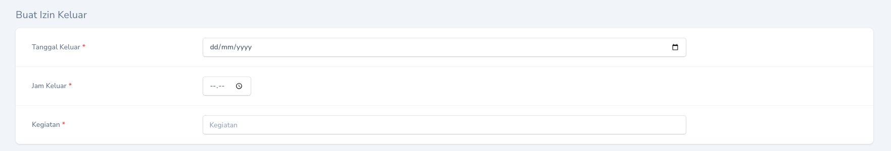
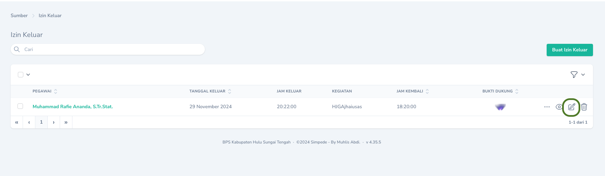
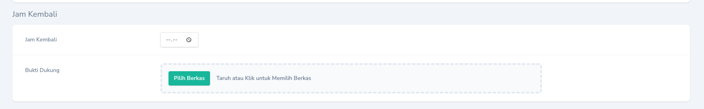

## Alur Permintaan Barang Persediaan

```mermaid
  flowchart TB
    subgraph
        direction TB
        top1[Pegawai Mengisi Bon Permintaan] --> bottom1[Pengelola Persediaan Menyetujui]
        bottom1 --> top2[Pengelola Persediaan Mencetak Bon Persediaan]
        top2 --> bottom2[Pegawai Menyerahkan Bon Permintaan Ke Pengelola Gudang]
        bottom2 --> top3[Pengelola Gudang Menyerahkan Barang persediaan]
    end
```

### Saat akan keluar kantor

Saat akan keluar kantor, pengajuan izin dapat dilakukan melalui Halaman Indeks dengan cara menekan tombol `Buat Izin Keluar` yang terdapat pada bagian kanan tabel. Isikan `Tanggal Keluar`, `Jam Keluar`, dan `Kegiatan`.
<Frame caption="Tampilan Menambahkan Izin Keluar">
    
</Frame>
<Frame caption="Tampilan Isian Saat Keluar Kantor">
    
</Frame>

### Saat kembali ke kantor

Saat telah kembali ke kantor, pegawai wajib mengisi jam kembali dan mengupload foto bukti dukung. Pelaporan tersebut dapat dilakukan dengan menekan `Tombol Sunting` pada record yang bersangkutan.
<Frame caption="Tampilan Melaporkan Kembali Ke Kantor">
    
</Frame>
<Frame caption="Tampilan Isian Jam Kembali dan Bukti Dukung">
    
</Frame>

## Mengubah

Untuk mengubah Izin Keluar dapat dilakukan dengan cara menekan `Tombol Sunting` pada record yang akan diubah.

## Menghapus

Untuk menghapus Izin Keluar dapat dilakukan dengan cara menekan `Tombol Hapus` pada record yang akan dihapus.


