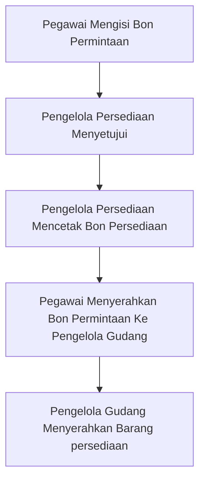

## Alur Permintaan Barang Persediaan

```mermaid
  flowchart TB
        top1[Pegawai Mengisi Bon Permintaan] --> bottom1[Pengelola Persediaan Menyetujui]
        bottom1 --> top2[Pengelola Persediaan Mencetak Bon Persediaan]
        top2 --> bottom2[Pegawai Menyerahkan Bon Permintaan Ke Pengelola Gudang]
        bottom2 --> top3[Pengelola Gudang Menyerahkan Barang persediaan]
```

