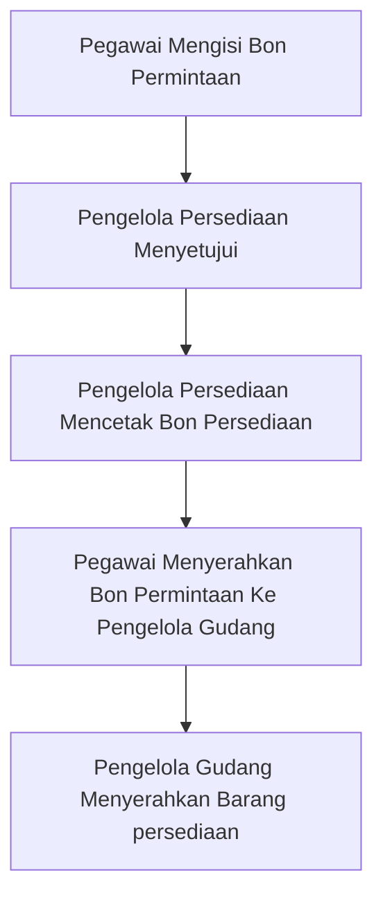
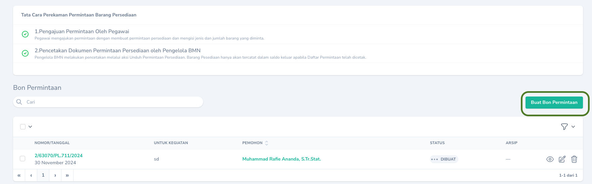
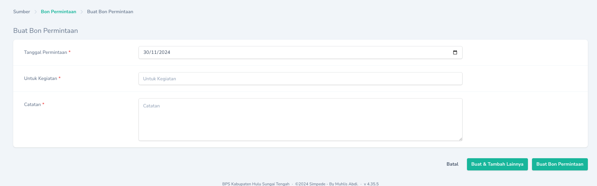
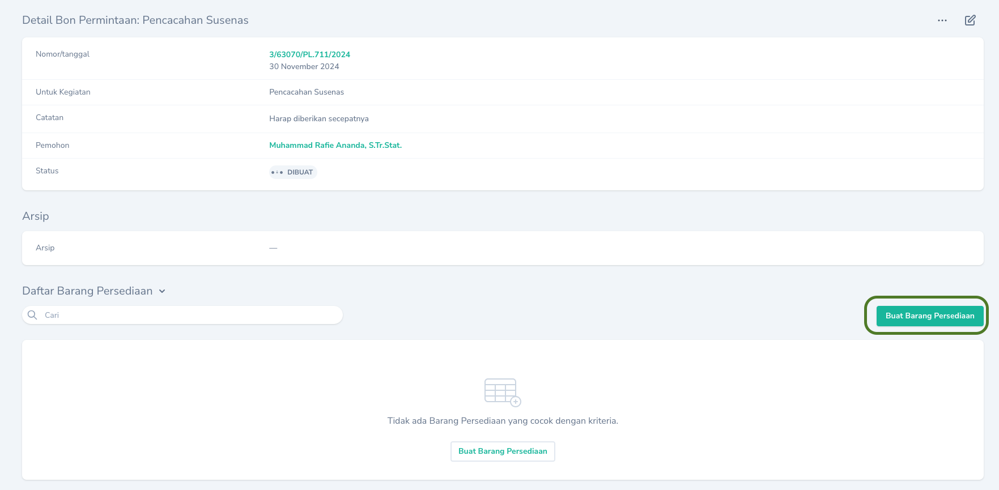
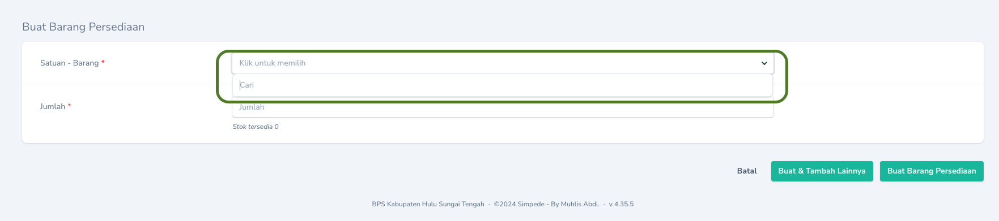

<Warning>
    Setiap Pegawai yang ingin menggunakan Barang Persediaan Wajib Mengisi Bon Permintaan.
</Warning>
## Alur Permintaan Barang Persediaan

## Membuat

Pembuatan Bon Permintaan dapat dilakukan melalui menu `Bon Permintaan`. Pada Halaman Indeks tekan tombol `Buat Bon Permintaan` yang terdapat pada bagian kanan tabel.

<Frame caption="Tampilan Menambahkan Bon Permintaan">
    
</Frame>

Selanjutnya isikan Keterangan yang diperlukan

<Frame caption="Tampilan Mengisi Keterangan Bon Permintaan">
    
</Frame>

### Menambahkan daftar barang

Penambahan Daftar Brang Persediaan yang akan diminta dapat dilakukan dengan mengkases `Halaman Detail` Bon Permintaan. Kemudian klik tombol `Buat Barang Persediaan`.
<Frame caption="Tampilan Menambahkan Daftar Barang Persediaan">
    
</Frame>

Pada saat menambahkan, ketik pada kolom pencarian untuk mencari jenis barang yang ingin diminta. 
<Warning>
    Pilihan tidak akan muncul sebelum Anda melakukan pencarian dengan mengetikkan nama barang yang ingin diminta.
</Warning>

<Frame caption="Tampilan Mencari Jenis Barang Persediaan">
    
</Frame>

## Mengubah

Untuk mengubah Bon Permintaan dapat dilakukan dengan cara menekan `Tombol Sunting` pada record yang akan diubah.

## Menghapus

Untuk menghapus Bon Permintaan dapat dilakukan dengan cara menekan `Tombol Hapus` pada record yang akan dihapus.