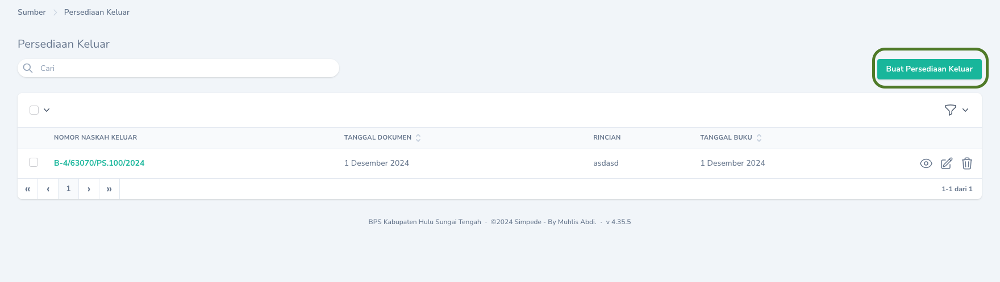
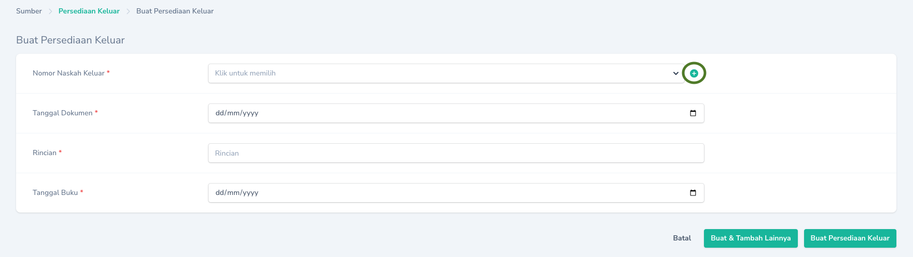

## Mencatat Persediaan Keluar

Pencatatan Barang Persediaan Keluar selain dari permintaan penggunaan dapat dilakukan melalui tombol `Tambah Persediaan Keluar`. Pada bagian `Rincian` isikan keterangan/jenis transaksi, misal: Hibah Keluar, Transfer Keluar, Reklas Keluar, dll.
<Frame caption="Tampilan Halaman Pencatatan Persediaan Keluar">
    
</Frame>

<Tip>
    Jika nomor Naskah Keluar belum tercatat pada daftar `Naskah Keluar`, Anda dapat langsung menambahkan dengan mengklik tombol <Icon icon="circle-plus" iconType="solid" />
<Frame caption="Tombol untuk menambahkan Nomor Naskah Keluar">
    
</Frame>
</Tip>

