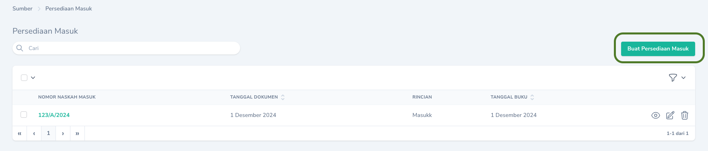
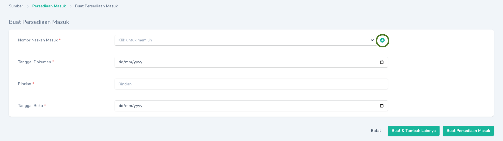

## Mencatat Persediaan Masuk

Pencatatan Barang Persediaan Masuk selain dari pembelian dapat dilakukan melalui tombol `Tambah Persediaan Masuk`. Pada bagian `Rincian` isikan keterangan/jenis transaksi, misal: Hibah Masuk, Transfer Masuk, Reklas Masuk, dll.
<Frame caption="Tampilan Halaman Pencatatan Persediaan Masuk">
    
</Frame>

<Tip>
    Jika nomor Naskah Masuk belum tercatat pada daftar `Naskah Masuk`, Anda dapat langsung menambahkan dengan mengklik tombol <Icon icon="circle-plus" iconType="solid" />
<Frame caption="Tombol untuk menambahkan Nomor Naskah Masuk">
    
</Frame>
</Tip>

