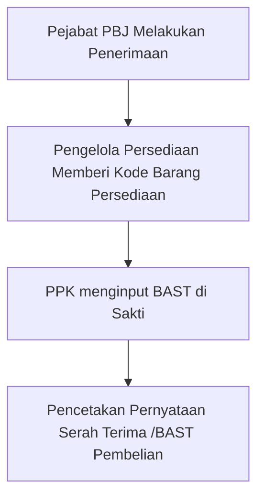

## Alur Pencatatan

## Penerimaan Barang

Penerimaan Barang dilakukan oleh Pejabat PBJ melalui menu `Manajemen` -> `Pembelian` dengan berpedoman pada langkah berikut.

<Steps>
  <Step title="Menginput Tanggal Nota">
    Input Tanggal Nota dilakukan melalui `Tombol Sunting` pada record yang akan diinput tanggal notanya.
    <Frame caption="Input Tanggal Nota">
        
    </Frame>
  </Step>
  <Step title="Melengkapi Rincain Barang Yang Diterima">
    Pejabat PBJ menambahkan rincian barang yang diterima melalui `Halaman Detail` Pembelian Persediaan dan mengklik tombol `Buat Barang Persediaan`.
      <Frame caption="Menambah Rincian Barang Persediaan yang diterima">
        
    </Frame>
    <Tip>
       Menambahkan rincian barang persediaan juga dapat dilakukan dengan menekan `Tombol Aksi` pada record yang akan ditambahkan rincian barangnya. Selanjutnya pilih aksi `Import dari KAK`. Dengan cara ini, Anda tidak perlu menambahkan satu per satu barang yang diterima, cukup sesuaikan dengan barang yang diterima.
    <Frame caption="Menambah Rincian Barang Persediaan melalui Import dari KAK">
        
    </Frame>
    </Tip>
  </Step>
    <Step title="Menandai Bahwa Barang Telah Diterima">
    Setelah barang persediaan ditambahkan sesuai dengan barang yang diterima. Pejabat PBJ menandai bahwa barang telah diterima dengan menekan `Tombol Aksi` dan memilih aksi `Terima Barang`
    <Frame caption="Menandai bahwa barang persediaan telah diterima">
        
    </Frame>
    <Warning>
        Tombol `Terima Barang` hanya akan muncul pada `Halaman Detil` Pembelian Persediaan. Hal ini bertujuan agar rincian barang persediaan diperiksa terlebih dahulu kesesuaiannya sebelum ditandai diterima
    </Warning>
  </Step>
</Steps>

## Pemberian Kode
<Warning>
    Saldo persediaan tidak akan dikurangi sebelum Bon Permintaan Persediaan dicetak!
</Warning>

## Pencatatan di Aplikasi Sakti

Untuk mencetak Bon Permintaan dapat dilakukan dengan cara menekan `Tombol Aksi` pada record yang akan dicetak, kemudian pilih `Unduh Permintaan Persediaan`.

<Frame caption="Tampilan Cetak Permintaan Persediaan">
    
</Frame>

<Tip>
    Anda dapat mengganti nama file BON Permintaan yang diunduh.
</Tip>

