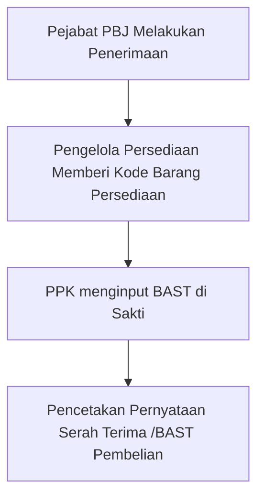

## Alur Pencatatan

## Penerimaan Barang

Penerimaan Barang dilakukan oleh Pejabat PBJ melalui menu `Manajemen` -> `Pembelian` dengan berpedoman pada langkah berikut.

<Steps>
  <Step title="Menginput Tanggal Nota">
    Input Tanggal Nota dilakukan melalui `Tombol Sunting` pada record yang akan diinput tanggal notanya.
    <Frame caption="Input Tanggal Nota">
        
    </Frame>
  </Step>
  <Step title="Melengkapi Rincain Barang Yang Diterima">
    Upload file excel yang telah diexport ke dalam Aplikasi BOS melalui tombol `Upload Excel`. Jangan lupa memberi ceklis pada pilihan `Terdapat Daftar Mitra SOBAT BPS`.
        <Frame caption="Import pada Aplikasi BOS">
        
    </Frame>
  </Step>
    <Step title="Menandai Bahwa Barang Telah Diterima">
    Upload file excel yang telah diexport ke dalam Aplikasi BOS melalui tombol `Upload Excel`. Jangan lupa memberi ceklis pada pilihan `Terdapat Daftar Mitra SOBAT BPS`.
        <Frame caption="Import pada Aplikasi BOS">
        
    </Frame>
  </Step>
</Steps>

## Pemberian Kode
<Warning>
    Saldo persediaan tidak akan dikurangi sebelum Bon Permintaan Persediaan dicetak!
</Warning>

## Pencatatan di Aplikasi Sakti

Untuk mencetak Bon Permintaan dapat dilakukan dengan cara menekan `Tombol Aksi` pada record yang akan dicetak, kemudian pilih `Unduh Permintaan Persediaan`.

<Frame caption="Tampilan Cetak Permintaan Persediaan">
    
</Frame>

<Tip>
    Anda dapat mengganti nama file BON Permintaan yang diunduh.
</Tip>

