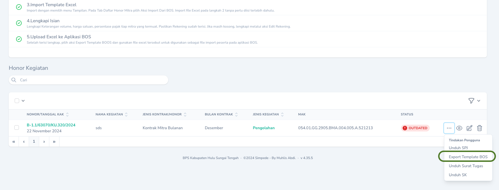
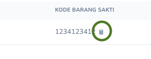

## Alur Pencatatan

## Penerimaan Barang

Penerimaan Barang dilakukan oleh Pejabat PBJ melalui menu `Persediaan` -> `Pembelian` dengan berpedoman pada langkah berikut.

<Steps>
  <Step title="Menginput Tanggal Nota">
    Input Tanggal Nota dilakukan melalui `Tombol Sunting` pada record yang akan diinput tanggal notanya.
    <Frame caption="Input Tanggal Nota">
        
    </Frame>
  </Step>
  <Step title="Melengkapi Rincian Barang Yang Diterima">
    Pejabat PBJ menambahkan rincian barang yang diterima melalui `Halaman Detail` Pembelian Persediaan dan mengklik tombol `Buat Barang Persediaan`.
      <Frame caption="Menambah Rincian Barang Persediaan yang diterima">
        
    </Frame>
    <Tip>
       Menambahkan rincian barang persediaan juga dapat dilakukan dengan menekan `Tombol Aksi` pada record yang akan ditambahkan rincian barangnya. Selanjutnya pilih aksi `Import dari KAK`. Dengan cara ini, Anda tidak perlu menambahkan satu per satu barang yang diterima.
    <Frame caption="Menambah Rincian Barang Persediaan melalui Import dari KAK">
        
    </Frame>
    </Tip>
  </Step>
    <Step title="Menandai Bahwa Barang Telah Diterima">
    Setelah barang persediaan ditambahkan sesuai dengan barang yang diterima. Pejabat PBJ menandai bahwa barang telah diterima dengan menekan `Tombol Aksi` dan memilih aksi `Terima Barang`
    <Frame caption="Menandai bahwa barang persediaan telah diterima">
        
    </Frame>
    <Warning>
        Tombol `Terima Barang` hanya akan muncul pada `Halaman Detil` Pembelian Persediaan. Hal ini bertujuan agar rincian barang persediaan diperiksa terlebih dahulu kesesuaiannya sebelum ditandai diterima.
    </Warning>
  </Step>
</Steps>

## Pemberian Kode
<Note>
    Pada saat barang persediasan telah diterima oleh Pejabat PBJ, Pengelola persediaan akan mendapatkann notifikasi untuk melakukan pengkodean barang persediaan.
<Frame caption="Tampilan Notifikasi Pengkodean Barang">
    
</Frame>
</Note>

Pemberian kode barang persediaan dapat dilakukan melalui `Halaman Detail` pada menu `Pembelian Persediaan`. Pilih `Tombol Sunting` pada daftar barang yang inin diberi kode.
<Frame caption="Tampilan Halaman untuk pengkodean barang persediaan">
    
</Frame>

<Tip>
    Jika kode barang persediaan belum ada pada Master Barang Persediaan, Anda dapat langsung menambahkan dengan mengklik tombol <Icon icon="circle-plus" iconType="solid" />
<Frame caption="Tombol untuk menambahkan kode barang persediaan">
    
</Frame>
</Tip>

## Mencetak Pernyataan Penerimaan
Tahap selanjutnya adalah mencetak Pernyataan Penerimaan Barang Persediaan oleh Pengelola Persediaan. Pernyataan ini dapat dicetak melalui `Tombol Aksi` pada record yang akan dicetak, kemudian pilih `Unduh Pernyataan Penerimaan`.
<Frame caption="Aksi Cetak Pernyataan Penerimaan">
    
</Frame>

<Warning>
    Saldo persediaan tidak akan berubah sebelum Pernyataan Penerimaan dicetak!
</Warning>

## Pencatatan di Aplikasi Sakti

Tahapan Selanjutnya adalah Pencatatan BAST Barang Persediaan di Aplikasi Sakti oleh Operator Komitmen. Pencatatan nomor BAST, Tanggal BAST, Tanggal Buku dan Kode Barang di Aplikasi Sakti berdasarkan keterangan yang terdapat di `Halaman Detail` Pembelian Persediaan.
<Frame caption="Tampilan Halaman detail Pembelian Persediaan">
    
</Frame>

<Tip>
    Anda dapat menekan tombol papan clipboard untuk menyalin kode barang.
<Frame caption="Tombol clipboard untuk menyalin kode barang">
    
</Frame>
</Tip>
