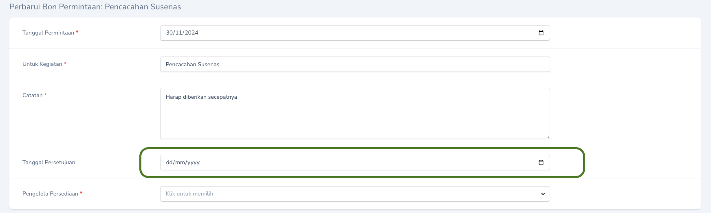

## Alur Permintaan Barang Persediaan

## Menyetujui Permintaan

Persetujuan Permintaan dapat dilakukan melalui menu `Bon Permintaan`. Pada Halaman Indeks tekan `Tombol Sunting` pada record yang ingin disetujui dan isikan tanggal persetujuan.

<Frame caption="Tampilan Persetujuan Bon Permintaan">
    
</Frame>

## Mencetak Bon Permintaan
<Warning>
    Saldo persediaan tidak akan dikurangi sebelum Bon Permintaan Persediaan dicetak!.
</Warning>

Untuk mencetak Bon Permintaan dapat dilakukan dengan cara menekan `Tombol Aksi` pada record yang akan dicetak, kemudian pilih `Unduh Permintaan Persediaan`.

<Frame caption="Tampilan Cetak Permintaan Persediaan">
    
</Frame>

<Tip>
    Anda dapat mengganti nama file BON Permintaan yang diunduh.
</Tip>

