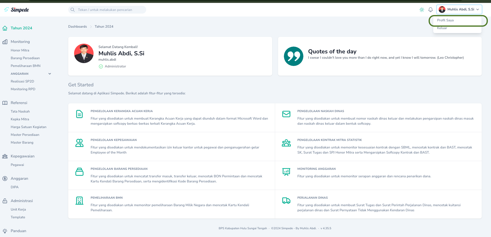
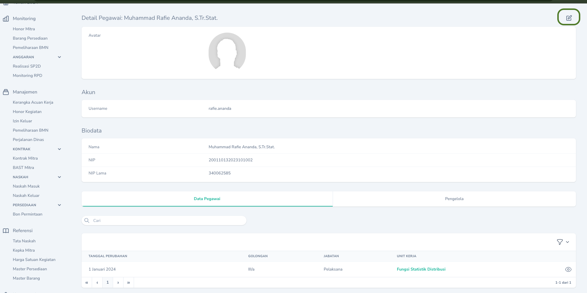
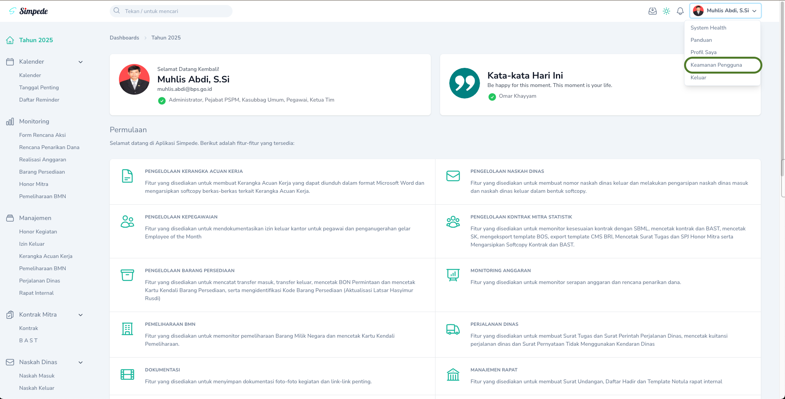

## Mengubah Avatar dan Biodata

Anda dapat mengubah Avatar, Rekening, dan Keterangan Lain dengan mengakses menu `Profil Saya` dan mengklik `Tombol Edit`.
<Frame caption="Tampilan Menu Profil Saya">
    
</Frame>
<Frame caption="Tampilan Tombol Edit">
    
</Frame>

## Mengubah Password dan Mengaktifkan MFA

Anda dapat mengubah Password dan Mengaktifkan MFA dengan mengakses menu `Keamanan Pengguna`.
<Frame caption="Tampilan Menu Keamanan Pengguna">
    
</Frame>

## Lupa Password

<Warning>
    Hubungi Admin jika lupa password.
</Warning>
