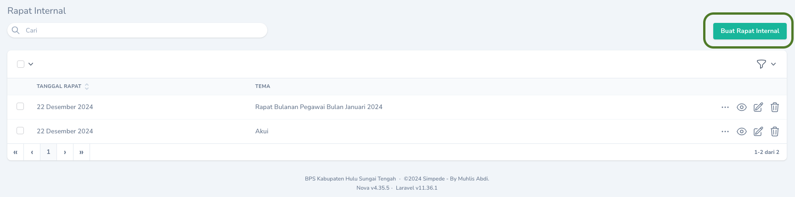
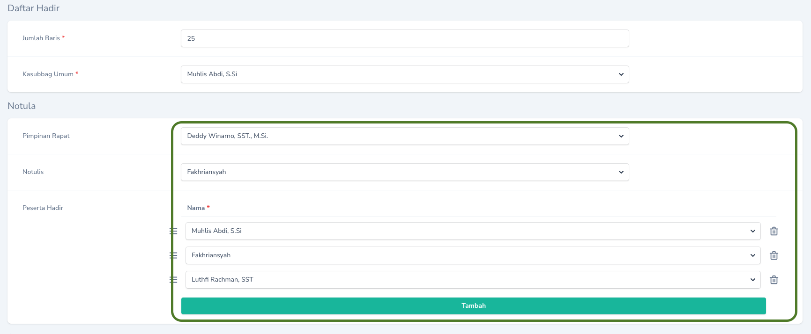
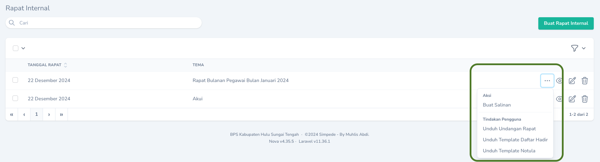

## Membuat
Pembuatan Rapat Internal dapat dilakukan melalui menu `Rapat Internal`. Pada Halaman Indeks, klik tombol `Buat Rapat Internal` yang terdapat pada bagian kanan tabel.
<Frame caption="Tampilan Membuat Rapat Internal">
    
</Frame>

## Mengubah

Untuk mengubah Rapat Internal, klik `Tombol Sunting` pada record yang akan diubah.

## Menghapus

Untuk menghapus Rapat Internal, tekan `Tombol Hapus` pada record yang akan dihapus.

## Mencetak Undangan, Daftar Hadir, dan Template Notula

Untuk mencetak Undangan, Daftar Hadir, maupun Template Notula, tekan `Tombol Aksi` pada record yang akan dicetak, kemudian pilih aksi yang sesuai.
<Warning>
    Pilihan aksi `Unduh Template Notula` hanya akan muncul apabila keterangan tentang notula telah diisi melalui menu `Sunting`.
    <Frame caption="Tampilan Sunting Keterangan Notula">
    
</Frame>
</Warning>

<Frame caption="Tampilan Cetak">
    
</Frame>

<Tip>
    Anda dapat mengganti nama file yang diunduh.
</Tip>
