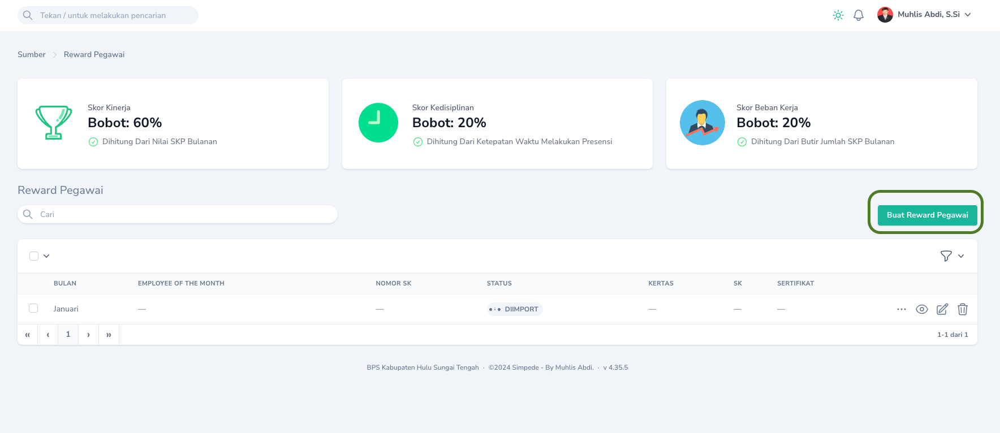
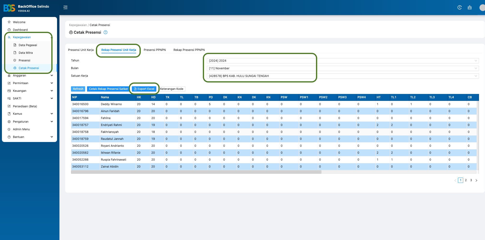
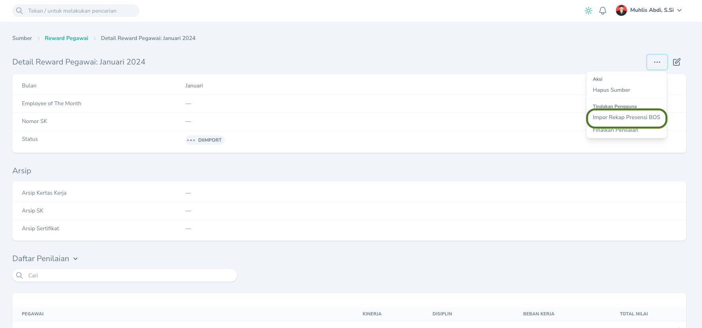
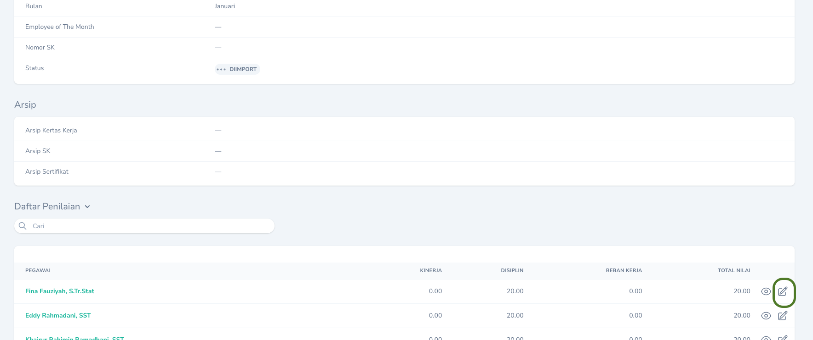
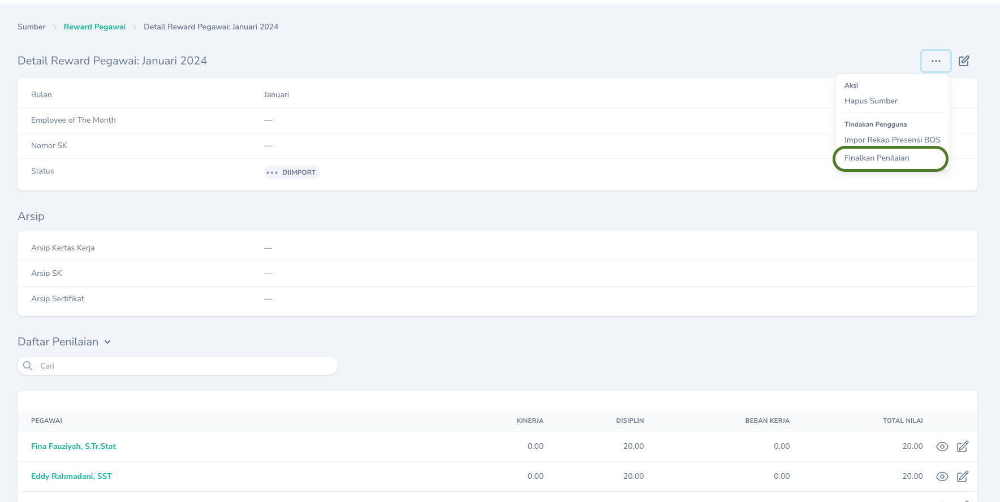
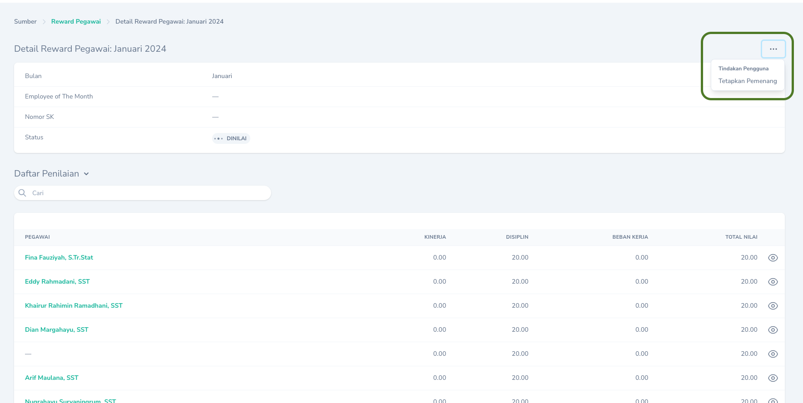
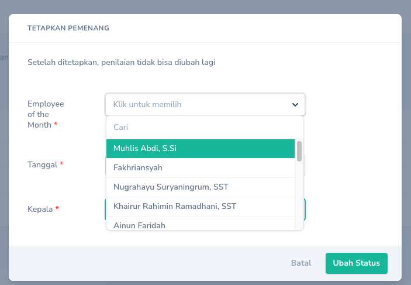
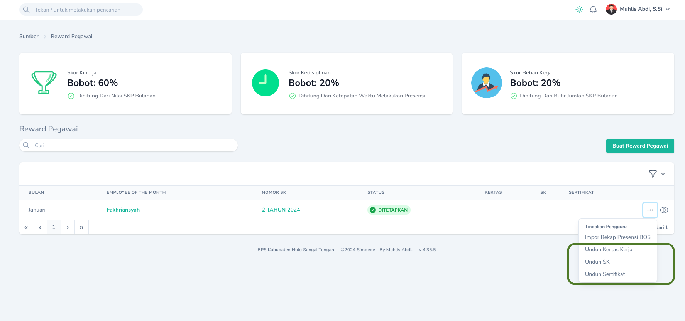

## Membuat
Untuk membuat _Reward_ Pegawai dapat dilakukan melalui Halaman Indeks dengan cara mengklik tombol `Buat Reward Pegawai` yang terdapat pada bagian kanan tabel.

<Frame caption="Tampilan Menambahkan Reward Pegawai">
    
</Frame>

## Penilaian
<Note>
    Dilakukan oleh : Kasubbag Umum
    > Menu : `Pegawai` > `Reward Pegawai`   
</Note>
Tahapan Penilaian:
<Steps>
    <Step title="Import Rekap Presensi">
        Login Ke Aplikasi BOS, pilih menu `Kepegawaian` -> `Cetak Presensi` -> `Rekap Presensi Unit Kerja`. Pilih bulan bersesuaian lalu pilih `Export Excel`.
        <Frame caption = "Export Rekap Absen dari aplikasi BOS">
            
        </Frame>
        Pilih `Tombol Aksi` dan pilih aksi `Impor Rekap Presensi BOS` lalu pilih file yang telah diexport sebelumnya.
        <Frame caption = "Import Rekap Absen dari aplikasi BOS">
            
        </Frame>
    </Step>
    <Step title="Input Penilaian SKP dan Jumlah Butir Pekerjaan">
        Input Penilaian SKP dan Jumlah Butir Pekerjaan melalui `Tombol Edit` pada tabel `Daftar Penilaian`.
         <Frame caption = "Import Rekap Absen dari aplikasi BOS">
            
        </Frame>
    </Step>
    <Step title="Finalisasi Penilaian">
       Setelah Input Penilaian SKP dan Butir Pekerjaan selesai dilakukan untuk seluruh pegawai, klik tombol `Finalkan Penilaian` untuk menyelesaikan penilaian.
         <Frame caption = "Finalisasi Penilaian">
            
        </Frame>
    </Step>
</Steps>

## Penetapan
<Note>
    Dilakukan oleh : Kepala
    > Menu : `Pegawai` > `Reward Pegawai`   
</Note>
Kepala melakukan penetapan _Employee of the Month_ dengan mengklik `Tombol Aksi` pada `Halaman Detail` dan memilih `Tetapkan Pemenang`.
         <Frame caption = "Penetapan Pemenang">
            
        </Frame>
Apabila terdapat lebih dari 1 orang yang mendapatkan nilai tertinggi, kepala dapat memilih salah satu pegawai yang akan ditetapkan sebagai _Employee of the Month_ dengan berbagai pertimbangan lain.
         <Frame caption = "Memilih Pemenang">
            
        </Frame>
<Warning>
    Hanya _Reward_ dengan status `DINILAI` yang dapat ditetapkan.
</Warning>

## Mengubah

Untuk mengubah _Reward_ Pegawai dapat dilakukan dengan cara mengklik `Tombol Sunting` pada record yang akan diubah.

## Menghapus

Untuk menghapus _Reward_ Pegawai dapat dilakukan dengan cara mengklik `Tombol Hapus` pada record yang akan dihapus.

## Mencetak
Pencetakan Kertas Kerja, Sertifikat dan SK _Employee of the Month_ dapat dilakukan dengan cara mengklik `Tombol Aksi` pada record yang akan dicetak, kemudian pilih aksi yang sesuai.

<Frame caption="Tampilan Cetak">
    
</Frame>

<Tip>
    Anda dapat mengganti nama file yang diunduh.
</Tip>
<Warning>
    Hanya _Reward_ dengan status `DITETAPKAN` yang dapat dicetak.
</Warning>
