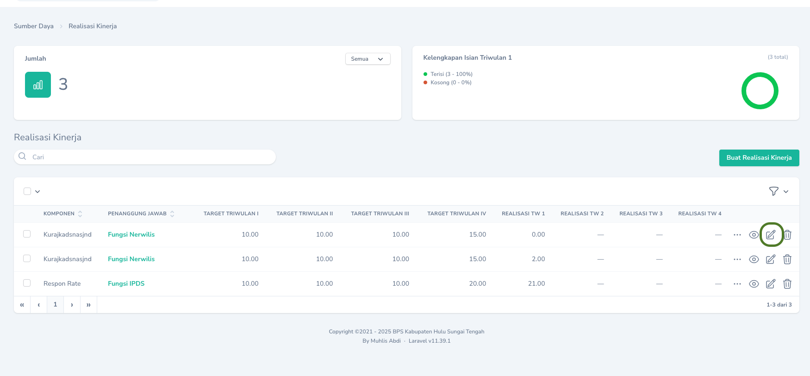
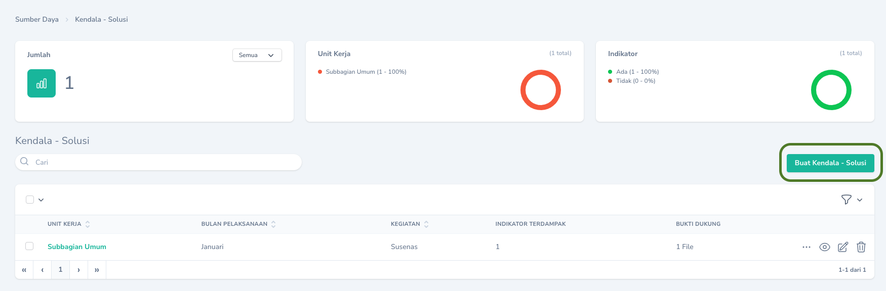
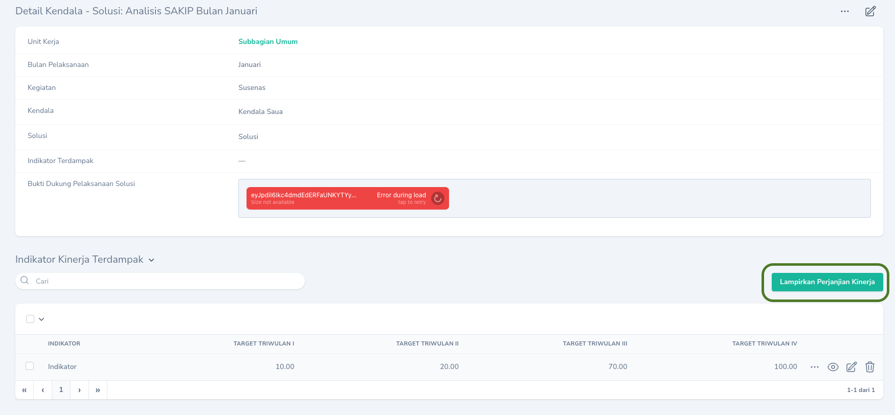
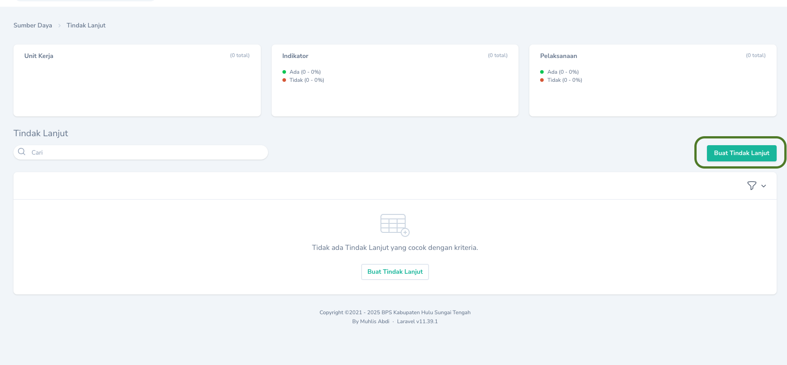
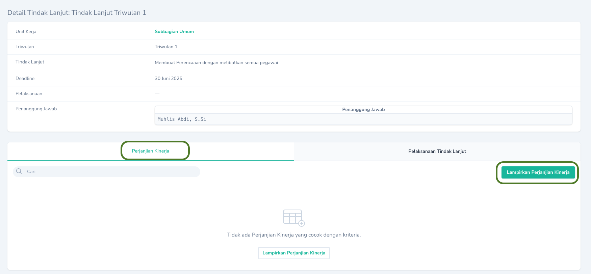
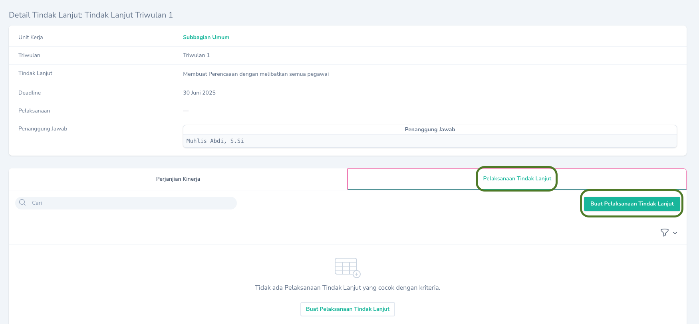

## Target dan Realisasi
<Note>
   > Penanggung Jawab : Kasubbag Umum, Ketua Tim Kerja
   > Waktu Pengisisan : 
   * 1 Maret - 10 April (Triwulan 1)
   * 1 Juni - 10 Juli (Triwulan 2)
   * 1 September - 10 Oktober (Triwulan 3)
   * 1 Desember - 10 Januari (Triwulan 4)
   > Menu : `SAKIP` -> `Realisasi Kinerja`
</Note>
Untuk pencatatan target dan realisasi dapat dilakukan dengan menekan tombol `Sunting` pada `Halaman Indeks` menu `Realisasi Kinerja`
<Frame caption="Tampilan Pencatatan Target dan Realisasi">
  
</Frame>

## Analisis SAKIP (Kendala - Solusi)
### Pencatatan Kendala dan Solusi
<Note>
   > Penanggung Jawab : Seluruh Pegawai
   > Waktu Pengisisan : Setiap Bulan
   > Menu : `SAKIP` -> `Kendala - Solusi`
</Note>
Untuk pencatatan kendala dan solusi dapat dilakukan dengan menekan tombol `Buat Kendala - Solusi` pada `Halaman Indeks` menu `Kendala - Solusi`
<Frame caption="Tampilan Pencatatan Kendala dan Solusi">
  
</Frame>
### Pengkategorian Indikator Kinerja
Setelah menambahkan kendala dan solusi, selanjutnya adalah mengkategorikan indikator kinerja yang terkait dengan kendala dan solusi yang telah diinputkan. Pilih indikator kinerja yang terdampak pada pelaksanaan solusi yang telah dibuat. Pilihan bisa lebih dari satu. Untuk memilih Indikator kinerja terdampak dapat dilakukan melalui `Halaman Detail` pada `Kendala - Solusi` dan pilih `Lampirkan Indikator Kinerja`.
<Frame caption="Memilih Indikator Kinerja terdampak">
  
</Frame>

## Rencana Tindak Lanjut
### Pencatatan Rencana Tindak Lanjut
<Note>
   > Penanggung Jawab : Kasubbag Umum, Ketua Tim Kerja
   > Waktu Pengisisan : 
   * 1 Maret - 10 April (Triwulan 1)
   * 1 Juni - 10 Juli (Triwulan 2)
   * 1 September - 10 Oktober (Triwulan 3)
   * 1 Desember - 10 Januari (Triwulan 4)
   > Menu : `SAKIP` -> `Tindak Lanjut`
</Note>
Untuk pencatatan rencana tindak lanjut dapat dilakukan dengan menekan tombol `Buat Tindak Lanjut` pada `Halaman Indeks` menu `Tindak Lanjut`
<Frame caption="Tampilan Pencatatan Rencana Tindak Lanjut">
  
</Frame>
### Pengkategorian Indikator Kinerja
Setelah menambahkan kendala dan solusi, selanjutnya adalah mengkategorikan indikator kinerja yang terkait dengan rencana tindak lanjut yang telah diinputkan. Pilih indikator kinerja yang terdampak pada pelaksanaan tindak lanjut yang telah dibuat. Pilihan bisa lebih dari satu. Untuk memilih Indikator kinerja terdampak dapat dilakukan melalui tab `Perjanjian Kinerja` di `Halaman Detail` pada `Tindak Lanjut` dan pilih `Lampirkan Indikator Kinerja`.
<Frame caption="Memilih Indikator Kinerja terdampak">
  
</Frame>

### Pengisian Pelaksanaan Tindak Lanjut
<Note>
   > Penanggung Jawab : Kasubbag Umum, Ketua Tim Kerja
   > Waktu Pengisisan : 
   * 1 April - 30 Juni (Tindak Lanjut Triwulan 1)
   * 1 Juli - 30 September (Tindak Lanjut Triwulan 2)
   * 1 Oktober - 31 Desember (Tindak Lanjut Triwulan 3)
   * 1 Januari - 31 Maret (Tindak Lanjut Triwulan 4)
   > Menu : `SAKIP` -> `Tindak Lanjut` lalu pilih salah satu tindak lanjut, dan buka `Halaman Detail` lalu pilih Tab `Pelaksanaan Tindak Lanjut`
</Note>
Tindak Lanjut yang telah dilaksanakan harus dilaksanakan dalam jangka waktu yang telah ditentukan. Untuk pencatatan pelaksanaan tindak lanjut dapat dilakukan dengan menekan tombol `Buat Pelaksanaan Tindak Lanjut` pada `Halaman Detail` menu `Tindak Lanjut` tab `Pelaksanaan Tindak Lanjut`
<Frame caption="Menambahkan Pelaksanaan Tindak LAnjut">
  
</Frame>

