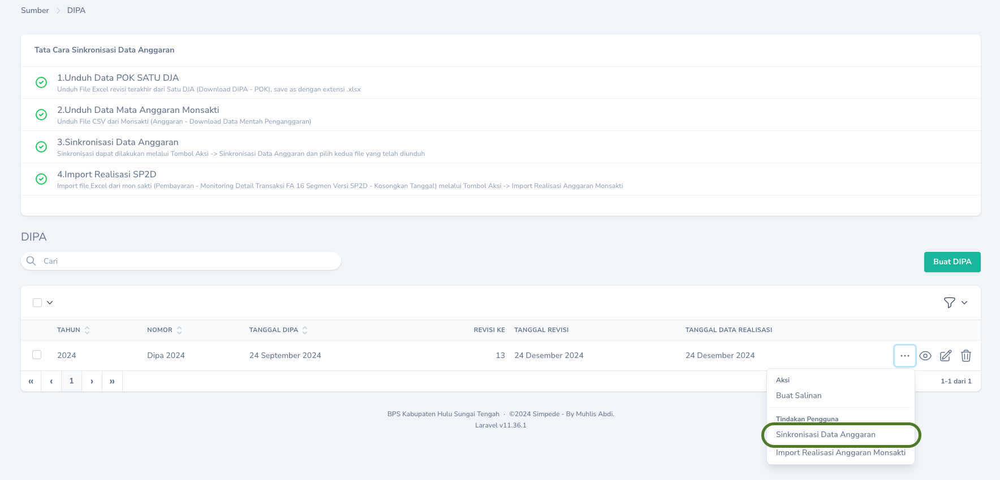

## Langkah-Langkah Sinkronisasi
Agar data anggaran selalu mutakhir, perlu dilakukan sinkronisasi dengan langkah-langkah sebagai berikut:
<Steps>
  <Step title="Unduh POK dari Aplikasi Satu DJA">
    Unduh data POK termutakhir melalui Aplikasi Satu DJA menu `Download DIPA` -> `POK` -> `Export ke Excel`.
    <Frame caption="Export Data POK di Aplikasi Satu DJA">
        
    </Frame>
  </Step>
  <Step title="Import Excel POK Satu DJA">
  <Warning>
    Sebelum melakukan import, pastikan file Excel POK yang diunduh dari Aplikasi Satu DJA sudah disimpan menggunakan format `.xlsx`.
  </Warning>
    Buka menu `Anggaran` -> `DIPA` lalu klik `Tombol Aksi` dan pilih `Import POK Satu DJA`
      <Frame caption="Import Excel POK Satu DJA">
        
    </Frame>
  </Step>
    <Step title="Unduh Data Mentah Anggaran dari Aplikasi Monsakti">
    Unduh Anggaran termutakhir melalui Aplikasi Monsakti menu `Anggaran` -> `Download Data Mentah Penganggaran`.
    <Frame caption="Unduh Data Mentah Anggaran dari Aplikasi Monsakti">
        
    </Frame>
  </Step>

      <Step title="Import Data Mentah Anggaran dari Aplikasi Monsakti">
    Buka menu `Anggaran` -> `DIPA` lalu klik `Tombol Aksi` dan pilih `Import Mata Anggaran Monsakti`
    <Frame caption="Unduh Data Mentah Anggaran dari Aplikasi Monsakti">
        
    </Frame>
    <Warning>
        Pada saat mengimport Data Mentah Anggaran dari Aplikasi Monsakti, hanya beri ceklis pada `Revisi RPD Triwulanan?` apabila data yang diimport adalah data revisi RPD Triwulanan.
            <Frame caption="Opsi Revisi RPD Triwulanan ">
        
    </Frame>
    </Warning>
  </Step>
</Steps>

