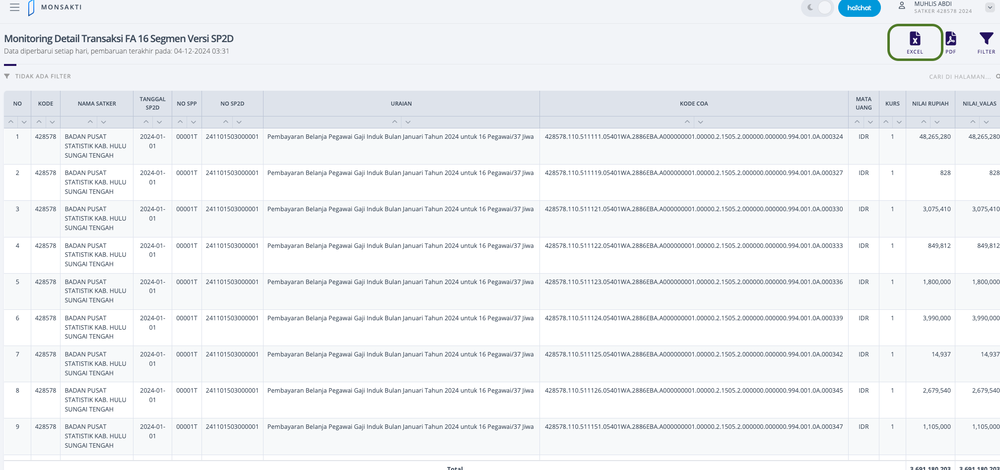
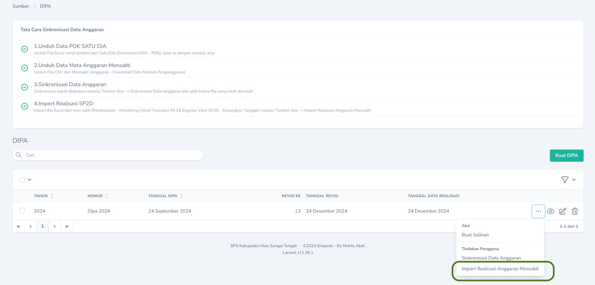

## Langkah-Langkah Sinkronisasi
Agar data serapan selalu mutakhir, perlu dilakukan sinkronisasi dengan langkah-langkah sebagai berikut:
<Steps>
    <Step title="Unduh Data Serapan Anggaran dari Aplikasi Monsakti">
    Unduh Data Serapan Anggaran secara berkala melalui Aplikasi Monsakti menu `Pembayaran` -> `Monitoring Detail Transaksi FA 16 Segmen Versi SP2D`. Biarkan Kosong pada pilihan `Tanggal SP2D` dan klik `Tombol Excel`.
    <Frame caption="Unduh Data Serapan Anggaran dari Aplikasi Monsakti">
        
    </Frame>
  </Step>

<Step title="Import Data Serapan Anggaran dari Aplikasi Monsakti">
    Buka menu `Anggaran` -> 'DIPA' lalu klik `Tombol Aksi` dan pilih `Import Realisasi Anggaran Monsakti`
    <Frame caption="Import Data Serapan Anggaran dari Aplikasi Monsakti">
        
    </Frame>
    <Warning>
        Pastikan Mata Anggaran telah dimutakhirkan terlebih dahulu sesuai data revisi terakhir sebelum mengimport data serapan anggaran.
    </Warning>
  </Step>
</Steps>

